# ERP系统测试文档

## 1. 引言

> 最后一次修改: 杨峥
>
> 最后一次修改日期: 2022/7/9

## 2. 单元测试

### 2.1 后端API测试

数据库此时已经过配置填充。

#### 2.1.1 API测试/总经理模块

> 最后一次修改: 赵勇臻
>
> 最后一次修改日期: 2022/07/09

##### GET 获取所有用户促销策略

GET /promotion/user/show-all

获取所有针对不同用户的促销策略

###### 请求参数

| 名称          | 位置   | 类型   | 必选 | 说明 |
| ------------- | ------ | ------ | ---- | ---- |
| Authorization | header | string | 否   | none |

> 返回示例

###### 返回结果

| 状态码 | 状态码含义                                              | 说明 | 数据模型 |
| ------ | ------------------------------------------------------- | ---- | -------- |
| 200    | [OK](https://tools.ietf.org/html/rfc7231#section-6.3.1) | 成功 | Inline   |

```json
{
    "code": "00000",
    "msg": "Success",
    "result": [
        {
            "effect_level": 50,
            "product_id": "0000000000400001",
            "product_amount": 2,
            "coupon": 500,
            "discount": 0.3,
            "begin_date": "2022-07-25T16:00:00.000+00:00",
            "end_date": "2022-07-27T16:00:00.000+00:00"
        },
        {
            "effect_level": 3,
            "product_id": "0000000000400001",
            "product_amount": 2,
            "coupon": 500,
            "discount": 0.3,
            "begin_date": "2022-07-25T16:00:00.000+00:00",
            "end_date": "2022-07-27T16:00:00.000+00:00"
        }
    ]
}
```


###### 预期结果

同上

##### GET 获取所有总价促销策略

GET /promotion/price/show-all

获取所有针对总价的促销策略

###### 请求参数

| 名称          | 位置   | 类型   | 必选 | 说明 |
| ------------- | ------ | ------ | ---- | ---- |
| Authorization | header | string | 否   | none |

> 返回示例

###### 返回结果

| 状态码 | 状态码含义                                              | 说明 | 数据模型 |
| ------ | ------------------------------------------------------- | ---- | -------- |
| 200    | [OK](https://tools.ietf.org/html/rfc7231#section-6.3.1) | 成功 | Inline   |

```json
{
    "code": "00000",
    "msg": "Success",
    "result": [
        {
            "effect_price": 50,
            "product_id": "0000000000500002",
            "product_amount": null,
            "coupon": 50,
            "begin_date": "2022-07-04T16:00:00.000+00:00",
            "end_date": "2022-07-21T16:00:00.000+00:00"
        },
        {
            "effect_price": 500,
            "product_id": "0000000000400001",
            "product_amount": 60,
            "coupon": 500,
            "begin_date": "2022-06-30T16:00:00.000+00:00",
            "end_date": "2022-07-02T16:00:00.000+00:00"
        }
    ]
}
```


###### 预期结果

同上

##### GET 获取所有特价包

GET /promotion/package/show-all

获取所有特价包

###### 请求参数

| 名称          | 位置   | 类型   | 必选 | 说明 |
| ------------- | ------ | ------ | ---- | ---- |
| Authorization | header | string | 否   | none |

> 返回示例

###### 返回结果

| 状态码 | 状态码含义                                              | 说明 | 数据模型 |
| ------ | ------------------------------------------------------- | ---- | -------- |
| 200    | [OK](https://tools.ietf.org/html/rfc7231#section-6.3.1) | 成功 | Inline   |

```json
{
    "code": "00000",
    "msg": "Success",
    "result": [
        {
            "product_id": [
                "0000000000400000",
                "0000000000400001"
            ],
            "product_amount": [
                1,
                1
            ],
            "voucher_amount": 1000,
            "begin_date": "2022-06-30T16:00:00.000+00:00",
            "end_date": "2022-07-07T16:00:00.000+00:00"
        },
        {
            "product_id": [
                "0000000000400001"
            ],
            "product_amount": [
                10
            ],
            "voucher_amount": 20,
            "begin_date": "2022-07-05T16:00:00.000+00:00",
            "end_date": "2022-07-21T16:00:00.000+00:00"
        },
        {
            "product_id": [
                "0000000000400000"
            ],
            "product_amount": [
                550
            ],
            "voucher_amount": 50,
            "begin_date": "2022-07-05T16:00:00.000+00:00",
            "end_date": "2022-07-22T16:00:00.000+00:00"
        },
        {
            "product_id": [
                "0000000000500001"
            ],
            "product_amount": [
                40404
            ],
            "voucher_amount": 50000,
            "begin_date": "2022-07-26T16:00:00.000+00:00",
            "end_date": "2022-07-29T16:00:00.000+00:00"
        },
        {
            "product_id": [
                "0000000000500001"
            ],
            "product_amount": [
                40404
            ],
            "voucher_amount": 50000,
            "begin_date": "2022-07-26T16:00:00.000+00:00",
            "end_date": "2022-07-29T16:00:00.000+00:00"
        }
    ]
}
```


###### 预期结果

同上

##### GET 显示所有代金券

GET /promotion/coupon/show

显示所有代金券

###### 请求参数

| 名称          | 位置   | 类型    | 必选 | 说明 |
| ------------- | ------ | ------- | ---- | ---- |
| customer_id   | query  | integer | 是   | none |
| Authorization | header | string  | 是   | none |

> 返回示例

###### 返回结果

| 状态码 | 状态码含义                                              | 说明 | 数据模型 |
| ------ | ------------------------------------------------------- | ---- | -------- |
| 200    | [OK](https://tools.ietf.org/html/rfc7231#section-6.3.1) | 成功 | Inline   |

```json
{
    "code": "00000",
    "msg": "Success",
    "result": [
        {
            "id": 2,
            "customer_id": 3,
            "amount": 1000
        },
        {
            "id": 3,
            "customer_id": 3,
            "amount": 1000
        },
        {
            "id": 4,
            "customer_id": 3,
            "amount": 1000
        },
        {
            "id": 8,
            "customer_id": 3,
            "amount": 1000
        },
        {
            "id": 9,
            "customer_id": 3,
            "amount": 1000
        },
        {
            "id": 10,
            "customer_id": 3,
            "amount": 10
        },
        {
            "id": 11,
            "customer_id": 3,
            "amount": 1000
        },
        {
            "id": 12,
            "customer_id": 3,
            "amount": 10
        },
        {
            "id": 13,
            "customer_id": 3,
            "amount": 1000
        },
        {
            "id": 14,
            "customer_id": 3,
            "amount": 10
        },
        {
            "id": 15,
            "customer_id": 3,
            "amount": 1000
        },
        {
            "id": 16,
            "customer_id": 3,
            "amount": 10
        }
    ]
}
```


###### 预期结果

同上

##### POST 创建用户促销策略

POST /promotion/user/create

创建针对不同用户的促销策略

> Body 请求参数

```json
{
    "effect_level": "3",
    "product_id": "0000000000400001",
    "product_amount": "2",
    "discount": "0.3",
    "coupon": "500",
    "begin_date": "2022-07-25T16:00:00.000Z",
    "end_date": "2022-07-27T16:00:00.000Z"
}
```

###### 请求参数

| 名称             | 位置   | 类型   | 必选 | 说明 |
| ---------------- | ------ | ------ | ---- | ---- |
| Authorization    | header | string | 否   | none |
| body             | body   | object | 否   | none |
| » effect_level   | body   | string | 是   | none |
| » product_id     | body   | string | 是   | none |
| » product_amount | body   | string | 是   | none |
| » discount       | body   | string | 是   | none |
| » coupon         | body   | string | 是   | none |
| » begin_date     | body   | string | 是   | none |
| » end_date       | body   | string | 是   | none |

> 返回示例

###### 返回结果

| 状态码 | 状态码含义                                              | 说明 | 数据模型 |
| ------ | ------------------------------------------------------- | ---- | -------- |
| 200    | [OK](https://tools.ietf.org/html/rfc7231#section-6.3.1) | 成功 | Inline   |

###### 预期结果

同上

#### 2.1.2 API测试/财务模块

> 最后一次修改: 何浩达
>
> 最后一次修改日期: 2022/07/09

##### GET 显示所有账户

GET /account/findAll

###### 请求参数

| 名称          | 位置   | 类型   | 必选 | 说明 |
| ------------- | ------ | ------ | ---- | ---- |
| Authorization | header | string | 否   | none |

###### 返回结果

| 状态码 | 状态码含义                                              | 说明 | 数据模型 |
| ------ | ------------------------------------------------------- | ---- | -------- |
| 200    | [OK](https://tools.ietf.org/html/rfc7231#section-6.3.1) | 成功 | Inline   |

```json
{
    "code": "00000",
    "msg": "Success",
    "result": [
        {
            "accountName": "a652",
            "amount": 326471
        },
        {
            "accountName": "HELLO",
            "amount": 600
        },
        {
            "accountName": "hhd",
            "amount": 100000
        }
    ]
}
```

###### 预期结果

```json
{
    "code": "00000",
    "msg": "Success",
    "result": [
        {
            "accountName": "a652",
            "amount": 326471
        },
        {
            "accountName": "HELLO",
            "amount": 600
        },
        {
            "accountName": "hhd",
            "amount": 100000
        }
    ]
}
```

##### POST 创建新的账户

POST /account/create

> Body 请求参数

```json
{
  "accountName": "hhd",
  "amount": "100000"
}
```

###### 请求参数

| 名称          | 位置   | 类型   | 必选 | 说明 |
| ------------- | ------ | ------ | ---- | ---- |
| Authorization | header | string | 否   | none |
| body          | body   | object | 否   | none |

###### 返回结果

| 状态码 | 状态码含义                                              | 说明 | 数据模型 |
| ------ | ------------------------------------------------------- | ---- | -------- |
| 200    | [OK](https://tools.ietf.org/html/rfc7231#section-6.3.1) | 成功 | Inline   |

```json
{
    "code": "00000",
    "msg": "Success",
    "result": {
        "accountName": "hhd",
        "amount": 100000
    }
}
```

###### 预期结果

```json
{
    "code": "00000",
    "msg": "Success",
    "result": {
        "accountName": "hhd",
        "amount": 100000
    }
}
```

##### GET 收款单查询测试

GET /incomeSheet/sheet-show

###### 请求参数

| 名称          | 位置   | 类型   | 必选 | 说明 |
| ------------- | ------ | ------ | ---- | ---- |
| Authorization | header | string | 否   | none |

###### 返回结果

| 状态码 | 状态码含义                                              | 说明 | 数据模型 |
| ------ | ------------------------------------------------------- | ---- | -------- |
| 200    | [OK](https://tools.ietf.org/html/rfc7231#section-6.3.1) | 成功 | Inline   |

```json
{
    "code": "00000",
    "msg": "Success",
    "result": [
        {
            "id": "SKD-20220704-00000",
            "customer_id": 2,
            "operator": "sky",
            "income_sheet_content": [
                {
                    "id": 38,
                    "income_sheetId": null,
                    "account": "1",
                    "amount": 1,
                    "remark": "1"
                },
                {
                    "id": 39,
                    "income_sheetId": null,
                    "account": "1",
                    "amount": 1,
                    "remark": "1"
                },
                {
                    "id": 40,
                    "income_sheetId": null,
                    "account": "1",
                    "amount": 1,
                    "remark": "1"
                },
                {
                    "id": 41,
                    "income_sheetId": null,
                    "account": "1",
                    "amount": 1,
                    "remark": "1"
                },
                {
                    "id": 42,
                    "income_sheetId": null,
                    "account": "1",
                    "amount": 1,
                    "remark": "1"
                },
                {
                    "id": 43,
                    "income_sheetId": null,
                    "account": "1",
                    "amount": 1,
                    "remark": "1"
                },
                {
                    "id": 44,
                    "income_sheetId": null,
                    "account": "1",
                    "amount": 1,
                    "remark": "1"
                },
                {
                    "id": 45,
                    "income_sheetId": null,
                    "account": "1",
                    "amount": 1,
                    "remark": "1"
                }
            ],
            "total_amount": 1,
            "state": "待审批",
            "create_time": "2022-07-04T14:37:13.000+00:00"
        },
        {
            "id": "SKD-20220704-00001",
            "customer_id": 1,
            "operator": "sky",
            "income_sheet_content": [
                {
                    "id": 46,
                    "income_sheetId": null,
                    "account": "1",
                    "amount": 1,
                    "remark": "1"
                }
            ],
            "total_amount": 1,
            "state": "待审批",
            "create_time": "2022-07-04T14:40:38.000+00:00"
        },
        {
            "id": "SKD-20220704-00002",
            "customer_id": 2,
            "operator": "sky",
            "income_sheet_content": [
                {
                    "id": 47,
                    "income_sheetId": null,
                    "account": "1",
                    "amount": 11,
                    "remark": "1"
                }
            ],
            "total_amount": 11,
            "state": "待审批",
            "create_time": "2022-07-04T14:47:47.000+00:00"
        },
        {
            "id": "SKD-20220704-00003",
            "customer_id": 2,
            "operator": "sky",
            "income_sheet_content": [
                {
                    "id": 48,
                    "income_sheetId": null,
                    "account": "1",
                    "amount": 1,
                    "remark": "1"
                }
            ],
            "total_amount": 1,
            "state": "待审批",
            "create_time": "2022-07-04T14:48:09.000+00:00"
        },
        {
            "id": "SKD-20220704-00004",
            "customer_id": 1,
            "operator": "sky",
            "income_sheet_content": [
                {
                    "id": 49,
                    "income_sheetId": null,
                    "account": "1",
                    "amount": 1,
                    "remark": "1"
                }
            ],
            "total_amount": 1,
            "state": "待审批",
            "create_time": "2022-07-04T14:53:32.000+00:00"
        },
        {
            "id": "SKD-20220704-00005",
            "customer_id": 2,
            "operator": "sky",
            "income_sheet_content": [
                {
                    "id": 50,
                    "income_sheetId": null,
                    "account": "1",
                    "amount": 1,
                    "remark": "1"
                }
            ],
            "total_amount": 1,
            "state": "待审批",
            "create_time": "2022-07-04T14:57:36.000+00:00"
        },
        {
            "id": "SKD-20220704-00006",
            "customer_id": 1,
            "operator": "sky",
            "income_sheet_content": [
                {
                    "id": 51,
                    "income_sheetId": null,
                    "account": "2",
                    "amount": 2,
                    "remark": "1"
                }
            ],
            "total_amount": 2,
            "state": "待审批",
            "create_time": "2022-07-04T14:58:27.000+00:00"
        },
        {
            "id": "SKD-20220704-00007",
            "customer_id": 1,
            "operator": "sky",
            "income_sheet_content": [
                {
                    "id": 52,
                    "income_sheetId": null,
                    "account": "1",
                    "amount": 1,
                    "remark": "1"
                }
            ],
            "total_amount": 1,
            "state": "待审批",
            "create_time": "2022-07-04T15:07:28.000+00:00"
        },
        {
            "id": "SKD-20220704-00008",
            "customer_id": 1,
            "operator": "sky",
            "income_sheet_content": [
                {
                    "id": 53,
                    "income_sheetId": null,
                    "account": null,
                    "amount": 10000,
                    "remark": "第一条"
                },
                {
                    "id": 54,
                    "income_sheetId": null,
                    "account": null,
                    "amount": 1000000,
                    "remark": "第二条"
                }
            ],
            "total_amount": 1010000,
            "state": "待审批",
            "create_time": "2022-07-04T15:08:57.000+00:00"
        },
        {
            "id": "SKD-20220704-00009",
            "customer_id": 2,
            "operator": "sky",
            "income_sheet_content": [
                {
                    "id": 55,
                    "income_sheetId": null,
                    "account": "bank",
                    "amount": 1,
                    "remark": "字符串"
                }
            ],
            "total_amount": 1,
            "state": "待审批",
            "create_time": "2022-07-04T15:11:11.000+00:00"
        }
    ]
}
```

###### 预期结果

* 同上

##### GET 付款单查询测试

GET /outcomeSheet/sheet-show

###### 请求参数

| 名称          | 位置   | 类型   | 必选 | 说明 |
| ------------- | ------ | ------ | ---- | ---- |
| Authorization | header | string | 否   | none |

###### 返回结果

| 状态码 | 状态码含义                                              | 说明 | 数据模型 |
| ------ | ------------------------------------------------------- | ---- | -------- |
| 200    | [OK](https://tools.ietf.org/html/rfc7231#section-6.3.1) | 成功 | Inline   |

```json
{
    "code": "00000",
    "msg": "Success",
    "result": [
        {
            "id": "SKD-20220705-00000",
            "customer_id": 2,
            "operator": "sky",
            "outcome_sheet_content": [
                {
                    "id": 38,
                    "outcome_sheetId": null,
                    "account": "bank",
                    "amount": 10000,
                    "remark": "付款01"
                }
            ],
            "total_amount": 10000,
            "state": "待审批",
            "create_time": "2022-07-05T01:38:33.000+00:00"
        },
        {
            "id": "SKD-20220705-00001",
            "customer_id": 2,
            "operator": "sky",
            "outcome_sheet_content": [
                {
                    "id": 39,
                    "outcome_sheetId": null,
                    "account": "bank1",
                    "amount": 10000,
                    "remark": "付款1"
                }
            ],
            "total_amount": 10000,
            "state": "待审批",
            "create_time": "2022-07-05T01:39:41.000+00:00"
        },
        {
            "id": "SKD-20220705-00002",
            "customer_id": 2,
            "operator": "sky",
            "outcome_sheet_content": [
                {
                    "id": 40,
                    "outcome_sheetId": null,
                    "account": "bank01",
                    "amount": 10000,
                    "remark": "第一笔付款"
                },
                {
                    "id": 41,
                    "outcome_sheetId": null,
                    "account": "bank02",
                    "amount": 150000,
                    "remark": "第二笔付款"
                }
            ],
            "total_amount": 160000,
            "state": "待审批",
            "create_time": "2022-07-05T01:43:15.000+00:00"
        },
        {
            "id": "SKD-20220705-00003",
            "customer_id": 2,
            "operator": "sky",
            "outcome_sheet_content": [
                {
                    "id": 42,
                    "outcome_sheetId": null,
                    "account": "bank01",
                    "amount": 1500,
                    "remark": "第一笔付款"
                },
                {
                    "id": 43,
                    "outcome_sheetId": null,
                    "account": "bank02",
                    "amount": 165230,
                    "remark": "第二笔付款"
                }
            ],
            "total_amount": 166730,
            "state": "待审批",
            "create_time": "2022-07-05T01:55:03.000+00:00"
        }
    ]
}
```

###### 预期结果

* 同上

#### 2.1.3 API测试/人力资源模块

> 最后一次修改: 杨峥
>
> 最后一次修改日期: 2022/07/09

##### GET 查询所有员工信息

GET /employee/findAllEmployee

###### 请求参数

| 名称          | 位置   | 类型   | 必选 | 说明 |
| ------------- | ------ | ------ | ---- | ---- |
| Authorization | header | string | 否   | none |

###### 返回结果

| 状态码 | 状态码含义                                              | 说明 | 数据模型 |
| ------ | ------------------------------------------------------- | ---- | -------- |
| 200    | [OK](https://tools.ietf.org/html/rfc7231#section-6.3.1) | 成功 | Inline   |

```json
{
    "code": "00000",
    "msg": "Success",
    "result": [
        {
            "id": 1,
            "name": "DTA",
            "gender": "男",
            "birthDate": "2022-06-30T15:17:42.000+00:00",
            "phoneNumber": "18168100075",
            "job": "INVENTORY_MANAGER",
            "jobLevel": 1,
            "account": "doomgrahamismyfather"
        },
        {
            "id": 2,
            "name": "刘钦老师",
            "gender": "男",
            "birthDate": "1986-06-30T14:17:42.000+00:00",
            "phoneNumber": "110",
            "job": "GM",
            "jobLevel": 1,
            "account": "seec67"
        },
        {
            "id": 3,
            "name": "赵锁子",
            "gender": "男",
            "birthDate": "1800-04-01T15:17:42.000+00:00",
            "phoneNumber": "201250178",
            "job": "INVENTORY_MANAGER",
            "jobLevel": 1,
            "account": "lockson"
        },
        {
            "id": 4,
            "name": "袜子socket",
            "gender": "男",
            "birthDate": "2008-06-30T15:17:42.000+00:00",
            "phoneNumber": "12306",
            "job": "INVENTORY_MANAGER",
            "jobLevel": 2,
            "account": "hahaVO"
        },
        {
            "id": 5,
            "name": "seecoder平台",
            "gender": "男",
            "birthDate": "2015-06-30T15:17:42.000+00:00",
            "phoneNumber": "123456789",
            "job": "INVENTORY_MANAGER",
            "jobLevel": 3,
            "account": "seecoder"
        },
        {
            "id": 6,
            "name": "兆星锐",
            "gender": "男",
            "birthDate": "1998-06-30T15:17:42.000+00:00",
            "phoneNumber": "4008823823",
            "job": "SALE_MANAGER",
            "jobLevel": 1,
            "account": "zxrhandsomeboy"
        },
        {
            "id": 7,
            "name": "赵如雷",
            "gender": "女",
            "birthDate": "2020-12-30T15:17:42.000+00:00",
            "phoneNumber": "20220708",
            "job": "SALE_STAFF",
            "jobLevel": 3,
            "account": "Thunder"
        },
        {
            "id": 8,
            "name": "大洞王爷",
            "gender": "男",
            "birthDate": "2022-02-24T15:17:42.000+00:00",
            "phoneNumber": "114514",
            "job": "GM",
            "jobLevel": 1,
            "account": "BigHoleShoes"
        },
        {
            "id": 9,
            "name": "勇哥大三加油",
            "gender": "男",
            "birthDate": "2022-07-08T15:17:42.000+00:00",
            "phoneNumber": "666",
            "job": "SALE_MANAGER",
            "jobLevel": 1,
            "account": "bravebrothergogogo"
        }
    ]
}
```

###### 预期结果

同上

##### POST 创建新员工

POST /employee/createEmployee

> Body 请求参数

```json
{
  "name": "Test_man",
  "gender": "男",
  "birthDate": "2022-07-08T15:17:42.000+00:00",
  "phoneNumber": "666",
  "job": "SALE_MANAGER",
  "jobLevel": 1,
  "account": "test"
}
```

###### 请求参数

| 名称 | 位置 | 类型   | 必选 | 说明 |
| ---- | ---- | ------ | ---- | ---- |
| body | body | object | 否   | none |

###### 返回结果

| 状态码 | 状态码含义                                              | 说明 | 数据模型 |
| ------ | ------------------------------------------------------- | ---- | -------- |
| 200    | [OK](https://tools.ietf.org/html/rfc7231#section-6.3.1) | 成功 | Inline   |

```json
{
    "code": "00000",
    "msg": "Success",
    "result": {
        "id": 10,
        "name": "Test_man",
        "gender": "男",
        "birthDate": "2022-07-08T15:17:42.000+00:00",
        "phoneNumber": "666",
        "job": "SALE_MANAGER",
        "jobLevel": 1,
        "account": "test"
    }
}
```

###### 预期结果

同上

##### GET 根据员工id查询其账户

GET /employee/findUser

###### 请求参数

| 名称          | 位置   | 类型    | 必选 | 说明 |
| ------------- | ------ | ------- | ---- | ---- |
| id            | query  | integer | 否   | none |
| Authorization | header | string  | 否   | none |

###### 返回结果

| 状态码 | 状态码含义                                              | 说明 | 数据模型 |
| ------ | ------------------------------------------------------- | ---- | -------- |
| 200    | [OK](https://tools.ietf.org/html/rfc7231#section-6.3.1) | 成功 | Inline   |

```json
{
    "code": "00000",
    "msg": "Success",
    "result": {
        "name": "lock",
        "role": "INVENTORY_MANAGER",
        "password": "123456"
    }
}
```

###### 预期结果

同上

##### GET 根据员工id查询缺勤天数

GET /employee/findAbsence

###### 请求参数

| 名称          | 位置   | 类型   | 必选 | 说明 |
| ------------- | ------ | ------ | ---- | ---- |
| username      | query  | string | 否   | none |
| Authorization | header | string | 否   | none |

###### 返回结果

| 状态码 | 状态码含义                                              | 说明 | 数据模型 |
| ------ | ------------------------------------------------------- | ---- | -------- |
| 200    | [OK](https://tools.ietf.org/html/rfc7231#section-6.3.1) | 成功 | Inline   |

```json
{
    "code": "00000",
    "msg": "Success",
    "result": 8
}
```

###### 预期结果

同上

##### POST 更新岗位信息

POST /job/updateJob

> Body 请求参数

```json
{
  "name": "SALE_STAFF",
  "basicSalary": 5000,
  "jobSalary": 6000,
  "jobLevel": 3,
  "calculateMethod": 2,
  "paymentMethod": "月薪制"
}
```

###### 请求参数

| 名称          | 位置   | 类型   | 必选 | 说明 |
| ------------- | ------ | ------ | ---- | ---- |
| Authorization | header | string | 否   | none |
| body          | body   | object | 否   | none |

###### 返回结果

| 状态码 | 状态码含义                                              | 说明 | 数据模型 |
| ------ | ------------------------------------------------------- | ---- | -------- |
| 200    | [OK](https://tools.ietf.org/html/rfc7231#section-6.3.1) | 成功 | Inline   |

```json
{
    "code": "00000",
    "msg": "Success",
    "result": "操作成功"
}
```

###### 预期结果

同上

##### GET 获取全部薪资计算方式

GET /job/findAllCalculateMethod

###### 请求参数

| 名称          | 位置   | 类型   | 必选 | 说明 |
| ------------- | ------ | ------ | ---- | ---- |
| Authorization | header | string | 否   | none |

###### 返回结果

| 状态码 | 状态码含义                                              | 说明 | 数据模型 |
| ------ | ------------------------------------------------------- | ---- | -------- |
| 200    | [OK](https://tools.ietf.org/html/rfc7231#section-6.3.1) | 成功 | Inline   |

```json
{
    "code": "00000",
    "msg": "Success",
    "result": [
        "基本工资 + 岗位工资 - 税款",
        "基本工资 + 提成 + 岗位工资 - 税款"
    ]
}
```

###### 预期结果

同上

##### GET 查询所有岗位信息

GET /job/findAllJob

###### 请求参数

| 名称          | 位置   | 类型   | 必选 | 说明 |
| ------------- | ------ | ------ | ---- | ---- |
| Authorization | header | string | 否   | none |

###### 返回结果

| 状态码 | 状态码含义                                              | 说明 | 数据模型 |
| ------ | ------------------------------------------------------- | ---- | -------- |
| 200    | [OK](https://tools.ietf.org/html/rfc7231#section-6.3.1) | 成功 | Inline   |

```json
{
    "code": "00000",
    "msg": "Success",
    "result": [
        {
            "name": "FINANCIAL_STAFF",
            "basicSalary": 1500,
            "jobSalary": 2500,
            "jobLevel": 1,
            "calculateMethod": 1,
            "paymentMethod": "月薪制"
        },
        {
            "name": "FINANCIAL_STAFF",
            "basicSalary": 2000,
            "jobSalary": 3000,
            "jobLevel": 2,
            "calculateMethod": 1,
            "paymentMethod": "月薪制"
        },
        {
            "name": "GM",
            "basicSalary": 100000,
            "jobSalary": 100000,
            "jobLevel": 1,
            "calculateMethod": 2,
            "paymentMethod": "年薪制"
        },
        {
            "name": "HR",
            "basicSalary": 1500,
            "jobSalary": 2500,
            "jobLevel": 1,
            "calculateMethod": 1,
            "paymentMethod": "月薪制"
        },
        {
            "name": "HR",
            "basicSalary": 2000,
            "jobSalary": 3000,
            "jobLevel": 2,
            "calculateMethod": 1,
            "paymentMethod": "月薪制"
        },
        {
            "name": "HR",
            "basicSalary": 3000,
            "jobSalary": 4000,
            "jobLevel": 3,
            "calculateMethod": 1,
            "paymentMethod": "月薪制"
        },
        {
            "name": "INVENTORY_MANAGER",
            "basicSalary": 1000,
            "jobSalary": 2000,
            "jobLevel": 1,
            "calculateMethod": 1,
            "paymentMethod": "年薪制"
        },
        {
            "name": "INVENTORY_MANAGER",
            "basicSalary": 1500,
            "jobSalary": 2500,
            "jobLevel": 2,
            "calculateMethod": 1,
            "paymentMethod": "月薪制"
        },
        {
            "name": "INVENTORY_MANAGER",
            "basicSalary": 2000,
            "jobSalary": 3000,
            "jobLevel": 3,
            "calculateMethod": 1,
            "paymentMethod": "月薪制"
        },
        {
            "name": "SALE_MANAGER",
            "basicSalary": 6000,
            "jobSalary": 6000,
            "jobLevel": 1,
            "calculateMethod": 2,
            "paymentMethod": "月薪制"
        },
        {
            "name": "SALE_STAFF",
            "basicSalary": 2000,
            "jobSalary": 3000,
            "jobLevel": 1,
            "calculateMethod": 2,
            "paymentMethod": "月薪制"
        },
        {
            "name": "SALE_STAFF",
            "basicSalary": 3000,
            "jobSalary": 4000,
            "jobLevel": 2,
            "calculateMethod": 2,
            "paymentMethod": "月薪制"
        },
        {
            "name": "SALE_STAFF",
            "basicSalary": 5000,
            "jobSalary": 6000,
            "jobLevel": 3,
            "calculateMethod": 2,
            "paymentMethod": "月薪制"
        }
    ]
}
```

###### 预期结果

同上

##### GET 获取全部薪资发放方式

GET /job/findAllPaymentMethod

###### 请求参数

| 名称          | 位置   | 类型   | 必选 | 说明 |
| ------------- | ------ | ------ | ---- | ---- |
| Authorization | header | string | 否   | none |

###### 返回结果

| 状态码 | 状态码含义                                              | 说明 | 数据模型 |
| ------ | ------------------------------------------------------- | ---- | -------- |
| 200    | [OK](https://tools.ietf.org/html/rfc7231#section-6.3.1) | 成功 | Inline   |

```json
{
    "code": "00000",
    "msg": "Success",
    "result": [
        "月薪制",
        "年薪制"
    ]
}
```

###### 预期结果

同上

##### GET 制定年终奖

GET /yearEndAwards/establishYearEndAwards

###### 请求参数

| 名称       | 位置  | 类型    | 必选 | 说明 |
| ---------- | ----- | ------- | ---- | ---- |
| employeeId | query | integer | 否   | none |
| awards     | query | integer | 否   | none |

###### 返回结果

| 状态码 | 状态码含义                                              | 说明 | 数据模型 |
| ------ | ------------------------------------------------------- | ---- | -------- |
| 200    | [OK](https://tools.ietf.org/html/rfc7231#section-6.3.1) | 成功 | Inline   |

```json
{
    "code": "00000",
    "msg": "Success",
    "result": "操作成功"
}
```

###### 预期结果

同上

##### GET 查看全部员工年终奖情况

GET /yearEndAwards/findAllYearEndSalary

###### 请求参数

| 名称          | 位置   | 类型   | 必选 | 说明 |
| ------------- | ------ | ------ | ---- | ---- |
| Authorization | header | string | 否   | none |

###### 返回结果

| 状态码 | 状态码含义                                              | 说明 | 数据模型 |
| ------ | ------------------------------------------------------- | ---- | -------- |
| 200    | [OK](https://tools.ietf.org/html/rfc7231#section-6.3.1) | 成功 | Inline   |

```json
{
    "code": "00000",
    "msg": "Success",
    "result": [
        {
            "employeeId": 1,
            "employeeName": "DTA",
            "totalSalaryExceptDecember": 0,
            "yearEndAwards": 550
        },
        {
            "employeeId": 2,
            "employeeName": "刘钦老师",
            "totalSalaryExceptDecember": 0,
            "yearEndAwards": 0
        },
        {
            "employeeId": 3,
            "employeeName": "赵锁子",
            "totalSalaryExceptDecember": 0,
            "yearEndAwards": 0
        },
        {
            "employeeId": 4,
            "employeeName": "袜子socket",
            "totalSalaryExceptDecember": 0,
            "yearEndAwards": 0
        },
        {
            "employeeId": 5,
            "employeeName": "seecoder平台",
            "totalSalaryExceptDecember": 0,
            "yearEndAwards": 0
        },
        {
            "employeeId": 6,
            "employeeName": "兆星锐",
            "totalSalaryExceptDecember": 0,
            "yearEndAwards": 0
        },
        {
            "employeeId": 7,
            "employeeName": "赵如雷",
            "totalSalaryExceptDecember": 8100,
            "yearEndAwards": 0
        },
        {
            "employeeId": 8,
            "employeeName": "大洞王爷",
            "totalSalaryExceptDecember": 0,
            "yearEndAwards": 0
        },
        {
            "employeeId": 9,
            "employeeName": "勇哥大三加油",
            "totalSalaryExceptDecember": 0,
            "yearEndAwards": 0
        },
        {
            "employeeId": 10,
            "employeeName": "Test_man",
            "totalSalaryExceptDecember": 0,
            "yearEndAwards": 0
        }
    ]
}
```

###### 预期结果

同上

## 3. 系统测试

### 销售人员

#### 1.  创建客户

+ 登录销售人员账户，进入客户管理页面，点击新增客户，并输入客户信息

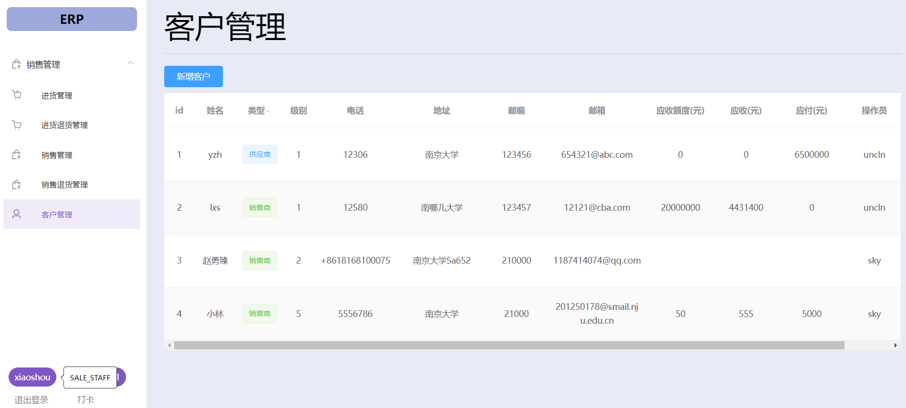

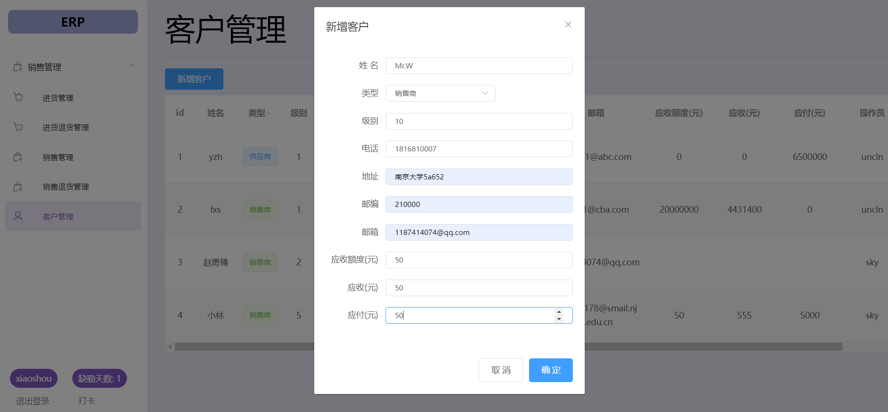

+ 点击确定后，发现已经创建好客户

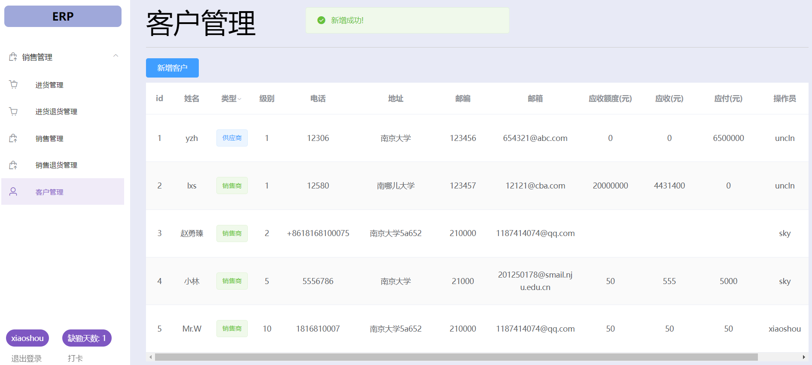

#### 2.  制定销售单以及审批

+ 进入销售管理页面点击创建销售单

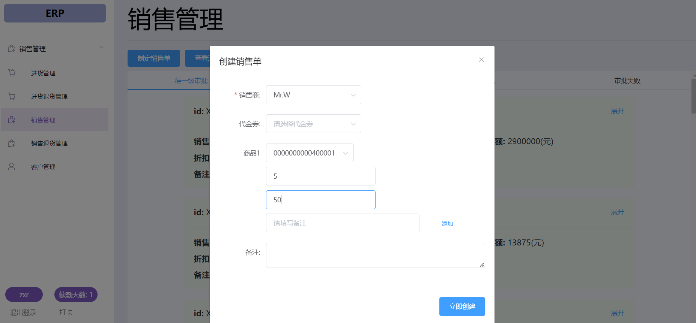

+ 创建完成后点击对勾，审批通过，销售单状态变为待总经理进行二级审批

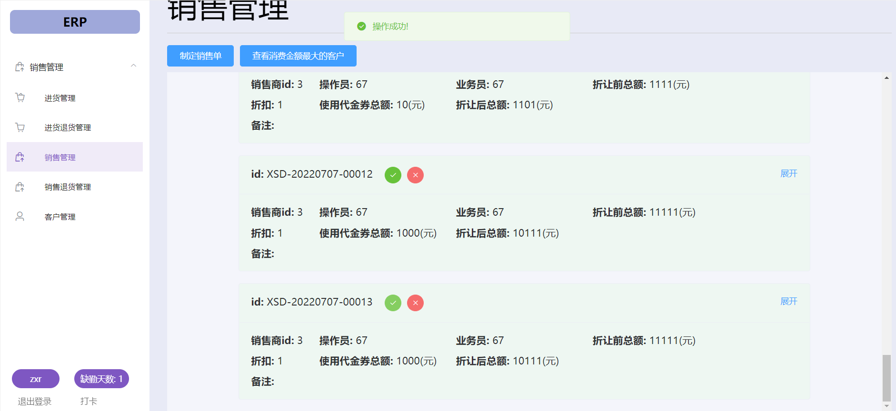

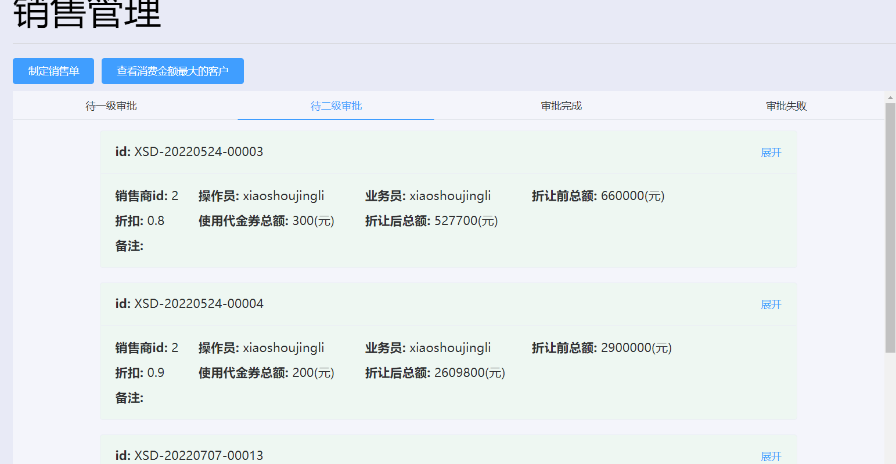

+ 否则，点击红色×，则状态变为审批失败

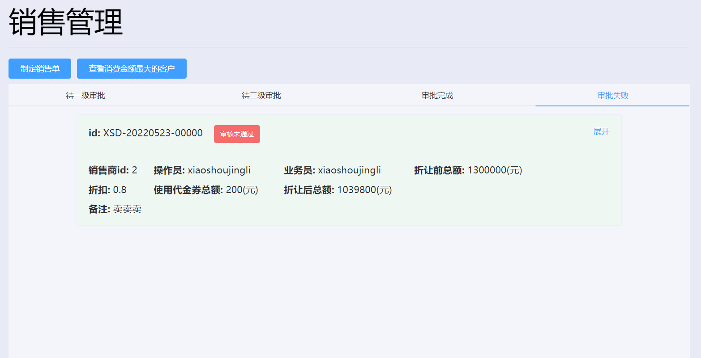

#### 3.  制定销售退货单以及审批

### 总经理

#### 1.审批单据

#### 2.制定年终奖

#### 3. 制定促销策略

+ 登录总经理账户，进入策略制定页面，默认进入“争对不同级别的用户制定促销策略”子页面。

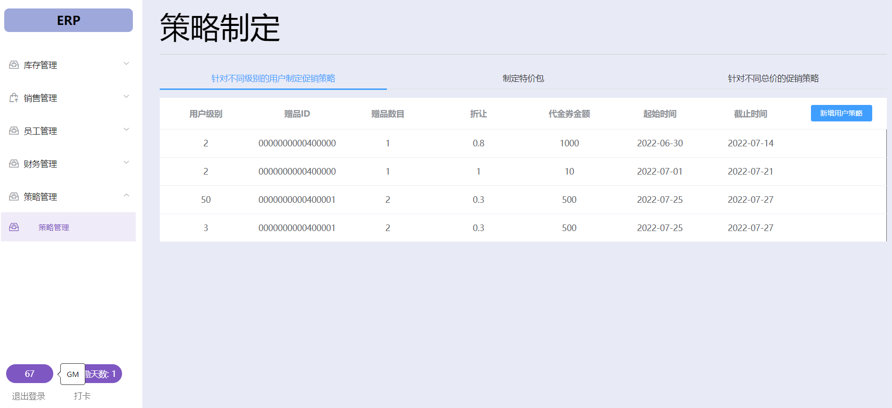

+ 点击新增用户策略，针对级别为10的用户制定销售策略，并点击立即创建。

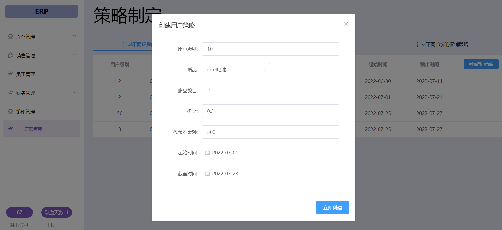

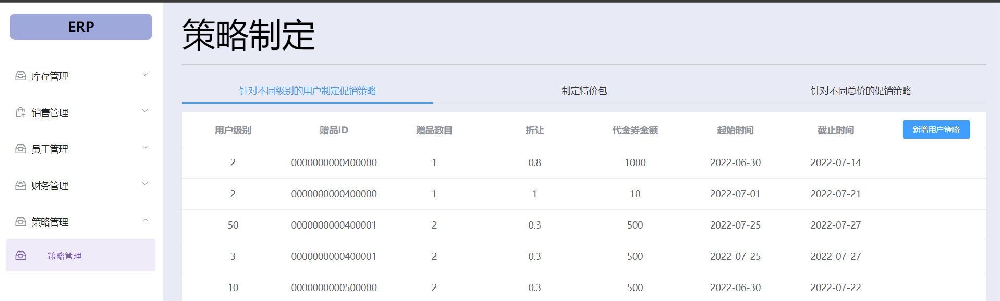

+ 策略创建后，当有用户的销售单被审批成功后，就会生成库存赠送单，并且送给该用户代金券

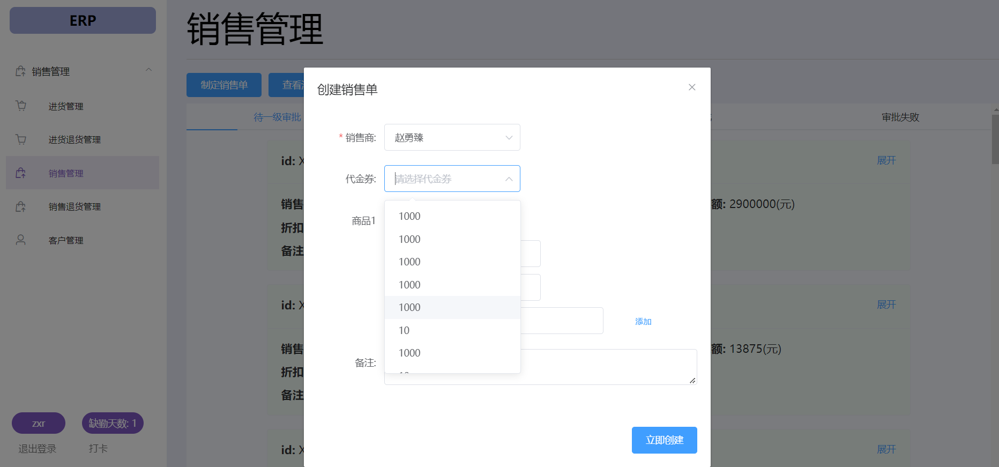

### 人力资源管理人员

#### 1.  员工打卡

#### 2. 岗位工资和工资单制定

#### 3.  工资发放单审批

### 财务人员

#### 1. 查看经营情况表

#### 2. 查看经营历程表以及红冲，红冲复制

#### 3. 查看经营情况表

#### 4. 查看销售明细表

### 
