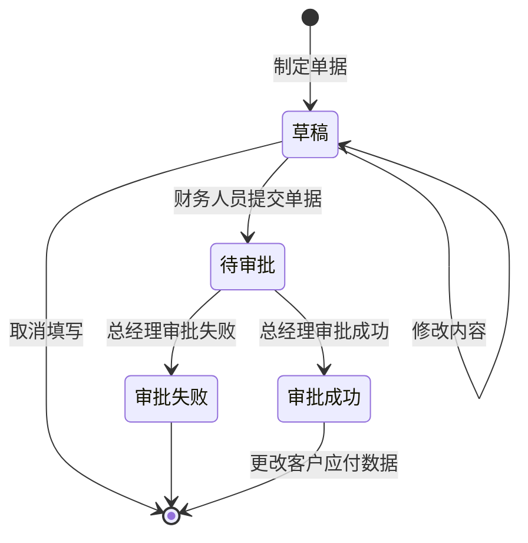
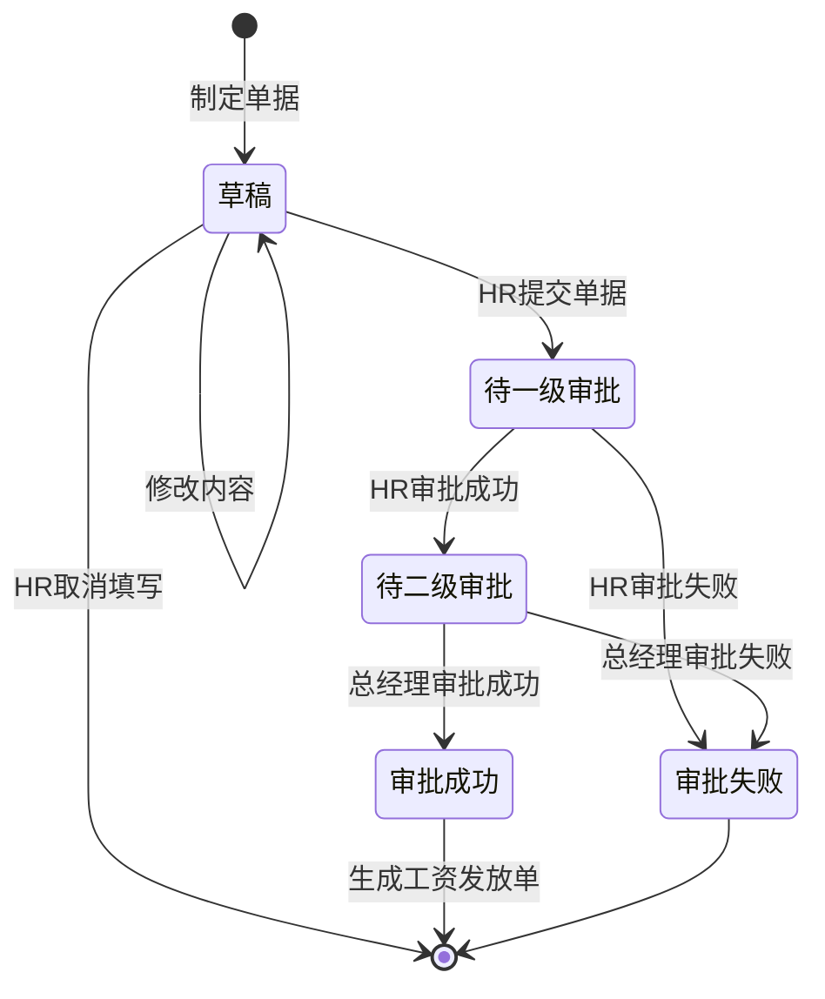

# ERP详细设计描述文档

> #### 5A652组 杨峥、何浩达、赵勇臻、张岳轩
>
> 最后更改于2022/07/09

| 修改人员 | 日期 | 修改原因 | 版本号 |
| :------: | :--: | :------: | :----: |
|  张岳轩  | 7.9  | 补充类图 |  v1.0  |
|          |      |          |        |

## 目录

[TOC]

## 1. 引言

> 最后一次修改者：张岳轩
>
> 最后一次修改时间：2022/07/08

### 1.1编制目的

本报告详细完成对ERP系统的详细设计，达到指导后续软件构造的目的，同时实现和测试人员及用户的沟通。

本报告面向开发人员、测试人员及最终用户编写，是了解系统的导航。

### 1.2 词汇表

| 词汇名称 |           词汇含义           | 备注 |
| :------: | :--------------------------: | :--: |
|   ERP    | 本文档的主体，即要描述的系统 |  无  |
|   B/S    |      浏览器/服务器架构       |  无  |
|    ……    |              ……              |  ……  |

### 1.3 参考资料

【1】.  IEEE相关标准;

【2】.  ERP系统第三阶段需求用例文档;

【3】.  ERP系统第三阶段需求规格说明文档

【4】.  ERP系统第三阶段体系结构文档

【5】.  软件工程与计算（卷二）：软件开发的技术基础 / 骆斌主编. ——北京：机械工业出版社, 2012.12;

## 2.产品概述

> 最后一次修改者：张岳轩
>
> 最后一次修改时间：2022/07/08

​	参考ERP系统用例文档和ERP系统软件需求规格对产品的概括描述。

## 3.体系结构设计概述

> 最后一次修改者：张岳轩
>
> 最后一次修改时间：2022/07/08

参考ERP系统概要设计文档中对体系结构设计的概述。

## 4.结构视角

> 最后一次修改者：张岳轩
>
> 最后一次修改时间：2022/07/08

### 4.1 业务逻辑层的分解

业务逻辑的开发包图参见软件体系结构文档

#### 4.1.1 财务模块(financebl)

（1）模块概述

financebl模块承担的需求见需求规格说明文档，职责及接口见体系结构文档。

（2）整体结构

财务模块主要有如下功能：管理账户，制定收/付款单、工资发放单，发放年终奖和查看经营信息。这几个功能分别都有Service层和Dao层接口。账户管理、制定单据都是常规的Service->ServiceImpl->Dao结构。经营信息分为销售明细SaleDetail和经营情况BusinessSituation, SaleDetail依赖销售单SaleSheetService和销售退货单SaleReturnSheetService，将符合条件的商品信息提取出来后返回。BusinessSituation依赖于各种单据的Service(详见下图)，获取各个单据的信息计算后返回。各种单据抽象出公共接口，采用面向接口编程。

.png)

| 模块                         | 职责                         |
| ---------------------------- | ---------------------------- |
| IncomeSheetServiceImpl       | 收款单的制定、查找和审批     |
| OutcomeSheetServiceImpl      | 付款单的制定、查找和审批     |
| SalaGrantSheetServiceImpl    | 工资发放单的制定、查找和审批 |
| BusinessSituationServiceImpl | 经营情况的查询               |
| SaleDetailServiceImpl        | 销售明细的查询               |
| BankAccountServiceImpl       | 银行账户的创建、查询和删除   |
| IncomeSheetContentPO         | 持有一条收款信息             |

（3）(部分)模块内部类的接口规范

*收款单、付款单和工资发放单的供需接口除了名字以外完全相同，因此此处只以付款单为例说明*

IncomeSheetServiceImpl接口规范

供接口

<table>
<tr>
  <th rowspan="3">IncomeSheetServiceImpl.makeIncomeSheet</th>
  <td>语法</td>
  <td>void makeIncomeSheet(UserVO userVO, IncomeSheetVO incomeSheetVO)</td>
</tr>
<tr>
  <td>前置条件</td>
  <td>财务人员进入收款单制定界面</td>
</tr>
<tr>
  <td>后置条件</td>
  <td>制定并持久化收款单，状态为待审批</td>
</tr>
<tr>
  <th rowspan="3">IncomeSheetServiceImpl.getSheetByState</th>
  <td>语法</td>
  <td>List< IncomeSheetVO> getSheetByState(IncomeSheetState incomeSheetState);</td>
</tr>
<tr>
  <td>前置条件</td>
  <td>财务人员进入收款单显示页面</td>
</tr>
<tr>
  <td>后置条件</td>
  <td>返回符合状态的所有收款单</td>
</tr>
<tr>
  <th rowspan="3">IncomeSheetServiceImpl.approval</th>
  <td>语法</td>
  <td>void approval(String id, IncomeSheetState state)</td>
</tr>
<tr>
  <td>前置条件</td>
  <td>总经理进入审批界面</td>
</tr>
<tr>
  <td>后置条件</td>
  <td>如果状态转移成功则将新状态持久化，否则原状态不改变</td>
</tr>	
</table>

需要的服务(需接口)

<table><tr>
  <th rowspan="3">Sheet.makeSheet</th>
  <td>语法</td>
  <td>void makeSheet(UserVO userVO, SheetVO sheetVO)</td>
</tr>
<tr>
  <td>前置条件</td>
  <td>无</td>
</tr>
<tr>
  <td>后置条件</td>
  <td>将指定的表单持久化</td>
</tr>
<tr>
  <th rowspan="3">Sheet.findSheetByState</th>
  <td>语法</td>
  <td>List< SheetVO> findSheetByState(SheetState state)</td>
</tr>
<tr>
  <td>前置条件</td>
  <td>无</td>
</tr>
<tr>
  <td>后置条件</td>
  <td>返回指定状态的单据</td>
</tr>
<tr>
  <th rowspan="3">Sheet.approval</th>
  <td>语法</td>
  <td>void approval(String sheetId, SheetState state)</td>
</tr>
<tr>
  <td>前置条件</td>
  <td>无</td>
</tr>
<tr>
  <td>后置条件</td>
  <td>如果状态转移成功则将新状态持久化，否则原状态不改变</td>
</tr>
</tr>

IncomeSheet接口规范

供接口

<table>
<tr>
  <th rowspan="3">Sheet.makeSheet</th>
  <td>语法</td>
  <td>void makeSheet(UserVO userVO, SheetVO sheetVO)</td>
</tr>
<tr>
  <td>前置条件</td>
  <td>无</td>
</tr>
<tr>
  <td>后置条件</td>
  <td>将指定的表单持久化</td>
</tr>
<tr>
  <th rowspan="3">Sheet.findSheetByState</th>
  <td>语法</td>
  <td>List< SheetVO> findSheetByState(SheetState state)</td>
</tr>
<tr>
  <td>前置条件</td>
  <td>无</td>
</tr>
<tr>
  <td>后置条件</td>
  <td>返回指定状态的单据</td>
</tr>
<tr>
  <th rowspan="3">Sheet.approval</th>
  <td>语法</td>
  <td>void approval(String sheetId, SheetState state)</td>
</tr>
<tr>
  <td>前置条件</td>
  <td>无</td>
</tr>
<tr>
  <td>后置条件</td>
  <td>如果状态转移成功则将新状态持久化，否则原状态不改变</td>
</tr>
</table>

需要的服务(需接口)

<table><tr>
  <th rowspan="3">IncomeSheetDao.getLatest</th>
  <td>语法</td>
  <td>IncomeSheetPO getLatest()</td>
</tr>
<tr>
  <td>前置条件</td>
  <td>无</td>
</tr>
<tr>
  <td>后置条件</td>
  <td>返回最新的收款表，如果为空则返回null</td>
</tr>
<tr>
  <th rowspan="3">IncomeSheetDao.saveSheet</th>
  <td>语法</td>
  <td>int saveSheet(IncomeSheetPO incomeSheetPO)</td>
</tr>
<tr>
  <td>前置条件</td>
  <td>要保存的单据在数据库中不存在</td>
</tr>
<tr>
  <td>后置条件</td>
  <td>持久化指定单据</td>
</tr>
<tr>
  <th rowspan="3">IncomeSheetDao.saveBatchSheetContent</th>
  <td>语法</td>
  <td>void saveBatchSheetContent(List<IncomeSheetContentPO> saveList)</td>
</tr>
<tr>
  <td>前置条件</td>
  <td>要保存的收款单表项对应的收款单不存在</td>
</tr>
<tr>
  <td>后置条件</td>
  <td>持久化单据表项</td>
</tr>
    <tr>
  <th rowspan="3">IncomeSheetDao.updateState</th>
  <td>语法</td>
  <td>int updateState(String id, IncomeSheetState state)</td>
</tr>
<tr>
  <td>前置条件</td>
  <td>要更新状态的收款单在数据库中已存在</td>
</tr>
<tr>
  <td>后置条件</td>
  <td>持久化更新后的收款单状态</td>
</tr>
</tr>
</tr>
    <tr>
  <th rowspan="3">IncomeSheetDao.updateState</th>
  <td>语法</td>
  <td>int updateState(String id, IncomeSheetState state)</td>
</tr>
<tr>
  <td>前置条件</td>
  <td>要更新状态的收款单在数据库中已存在</td>
</tr>
<tr>
  <td>后置条件</td>
  <td>持久化更新后的收款单状态</td>
</tr>
</tr>

BusinessSituationServiceImpl接口规范

供接口

<table>
<tr>
  <th rowspan="3">BusinessSituationService.getBusinessSituationByTime</th>
  <td>语法</td>
  <td>public BusinessSituationVO getBusinessSituationByTime(String beginDateStr, String endDateStr)</td>
</tr>
<tr>
  <td>前置条件</td>
  <td>财务人员或总经理进入经营情况显示界面</td>
</tr>
<tr>
  <td>后置条件</td>
  <td>返回指定时间区间内的销售情况</td>
</tr>
</table>

需要的服务(需接口)

<table>
<tr>
  <th rowspan="3">PurchaseSheetService.getSheetByState</th>
  <td>语法</td>
  <td>List< PurchaseSheetVO> getPurchaseSheetByState(PurchaseSheetState state)</td>
</tr>
<tr>
  <td>前置条件</td>
  <td>无</td>
</tr>
<tr>
  <td>后置条件</td>
  <td>返回所有指定状态的单据</td>
</tr>
<tr>
  <th rowspan="3">PurchaseReturnSheetService.getSheetByState</th>
  <td>语法</td>
  <td>List< PurchaseReturnSheetVO> getPurchaseReturnSheetByState(PurchaseReturnSheetState state)</td>
</tr>
<tr>
  <td>前置条件</td>
  <td>无</td>
</tr>
<tr>
  <td>后置条件</td>
  <td>返回所有指定状态的单据</td>
</tr>
<tr>
  <th rowspan="3">SaleSheetService.getSheetByState</th>
  <td>语法</td>
  <td>List< SaleSheetVO> getSaleSheetByState(SaleSheetState state)</td>
</tr>
<tr>
  <td>前置条件</td>
  <td>无</td>
</tr>
<tr>
  <td>后置条件</td>
  <td>返回所有指定状态的单据</td>
</tr>
<tr>
  <th rowspan="3">SaleReturnSheetService.getSheetByState</th>
  <td>语法</td>
  <td>List< SaleReturnSheetVO> getSaleReturnSheetByState(SaleReturnSheetState state)</td>
</tr>
<tr>
  <td>前置条件</td>
  <td>无</td>
</tr>
<tr>
  <td>后置条件</td>
  <td>返回所有指定状态的单据</td>
</tr>
<tr>
  <th rowspan="3">SalaryGrantSheetService.getSheetByState</th>
  <td>语法</td>
  <td>List< SalaryGrantSheetVO> getSalaryGrantSheetByState(SalaryGrantSheetState state)</td>
</tr>
<tr>
  <td>前置条件</td>
  <td>无</td>
</tr>
<tr>
  <td>后置条件</td>
  <td>返回所有指定状态的单据</td>
</tr>
</tr>

SaleDetailServiceImpl接口规范

供接口

<table>
<tr>
  <th rowspan="3">SaleDetail.findAll</th>
  <td>语法</td>
  <td>public List< SaleRecordVO> findAllRecords()</td>
</tr>
<tr>
  <td>前置条件</td>
  <td>财务人员进入销售明细表显示界面</td>
</tr>
<tr>
  <td>后置条件</td>
  <td>返回所有审批成功的销售单/销售退货单</td>
</tr>
</table>

需要的服务(需接口)

<table>
<tr>
  <th rowspan="3">SaleSheetService.getSheetByState</th>
  <td>语法</td>
  <td>List< SaleSheetVO> getSaleSheetByState(SaleSheetState state)</td>
</tr>
<tr>
  <td>前置条件</td>
  <td>无</td>
</tr>
<tr>
  <td>后置条件</td>
  <td>返回所有指定状态的单据</td>
</tr>
<tr>
  <th rowspan="3">SaleReturnSheetService.getSheetByState</th>
  <td>语法</td>
  <td>List< SaleReturnSheetVO> getSaleReturnSheetByState(SaleReturnSheetState state)</td>
</tr>
<tr>
  <td>前置条件</td>
  <td>无</td>
</tr>
<tr>
  <td>后置条件</td>
  <td>返回所有指定状态的单据</td>
</tr>
    </tr>

BankAccountServiceImpl接口规范

供接口

<table>
<tr>
  <th rowspan="3">SaleDetail.createBankAccount</th>
  <td>语法</td>
  <td>BankAccountVO createBankAccount(BankAccountVO inputVO)</td>
</tr>
<tr>
  <td>前置条件</td>
  <td>财务人员进入账户创建界面</td>
</tr>
<tr>
  <td>后置条件</td>
  <td>持久化用户对应的账户</td>
</tr>
<tr>
  <th rowspan="3">SaleDetail.findAll</th>
  <td>语法</td>
  <td>List< BankAccountVO> findAll()</td>
</tr>
<tr>
  <td>前置条件</td>
  <td>无</td>
</tr>
<tr>
  <td>后置条件</td>
  <td>返回所有账户信息</td>
</tr>
<tr>
  <th rowspan="3">SaleDetail.delete</th>
  <td>语法</td>
  <td>void delete(String accountName)</td>
</tr>
<tr>
  <td>前置条件</td>
  <td>要求删除的账户存在</td>
</tr>
<tr>
  <td>后置条件</td>
  <td>从数据库中删除</td>
</tr>
</table>

需要的服务(需接口)

<table>
<tr>
  <th rowspan="3">BankAccountDao.createBankAccount</th>
  <td>语法</td>
  <td>void createBankAccount(BankAccountPO bankAccountPO)</td>
</tr>
<tr>
  <td>前置条件</td>
  <td>要创建的账户当前还不存在</td>
</tr>
<tr>
  <td>后置条件</td>
  <td>持久化该账户信息</td>
</tr>
<tr>
  <th rowspan="3">BankAccountDao.findAll</th>
  <td>语法</td>
  <td>List< BankAccountPO> findAll()</td>
</tr>
<tr>
  <td>前置条件</td>
  <td>无</td>
</tr>
<tr>
  <td>后置条件</td>
  <td>返回数据库中所有账户信息</td>
</tr>
<tr>
  <th rowspan="3">BankAccountDao.deleteOneByAccountName</th>
  <td>语法</td>
  <td>void deleteOneByAccountName(String accountName)</td>
</tr>
<tr>
  <td>前置条件</td>
  <td>要删除的账户在数据库中存在</td>
</tr>
<tr>
  <td>后置条件</td>
  <td>删除指定的账户信息</td>
</tr>

（4）动态视角

制定单据的顺序图如下（同样只以收款单为例）

查询经营情况表的顺序图如下：

收款单状态图如下：

（5）业务逻辑层的设计原理

利用委托式控制风格，每个界面需要访问的业务逻辑由各自的控制器委托给不同领域的对象。

#### 4.1.2 人力资源模块(HRbl)

（1）模块概述

HRbl模块承担的需求见需求规格说明文档，职责及接口见体系结构文档。

（2）整体结构

HR模块包含三个主要功能：员工管理（包含打卡、制定员工岗位、薪酬规则等）、岗位管理和工资单制定。三个功能分别有Service层和Dao层接口EmployeeService、JobService、SalaryService(Dao同理)。工资单采用面向接口编程，实现了Sheet接口(包含制定、获取和审批三个行为)。每个工作岗位对应一种工资计算方式(工资的构成)和工资发放方式(年薪制or月薪制)。其中，工资计算方式采用**策略模式**实现。所有具体的工资计算方式都实现`CalculateMethod`接口，它有两个行为，一个是接收员工和其岗位信息输出他的实发工资、税款等，另一个是打印表达自己的字符串(用于返回前端显示)。税款的计算采用表驱动的方式，按应发工资阶梯式计税。工资单通过访问**委托式控制类**CalculateCtl来计算薪资

.png)

重要类的职责如下：

| 模块                | 职责                                                         |
| ------------------- | ------------------------------------------------------------ |
| EmployeeServiceImpl | 创建员工、员工打卡                                           |
| JobServiceImpl      | 岗位管理(调整岗位的工资、发放方式和计算方式等)               |
| SalaryServiceImpl   | 通过调用Sheet实现工资单的制定、查询和审批,审批成功后生成工资发放单 |
| CalculateCtl        | 工资计算方式的委托式控制器，负责初始化、获取以及添加工资计算方式 |
| CalculateMethod     | 负责根据员工的岗位、打卡等信息计算应发工资；还提供toString方法，用于前端显示 |
| TaxMethod           | 根据应发工资阶梯计算扣税信息(包含住房公积金、养老保险和个人所得税) |

（3）模块内部类的接口规范

EmployeeServiceImpl接口规范

供接口

<table>
<tr>
  <th rowspan="3">EmployeeServiceImpl.createEmployee</th>
  <td>语法</td>
  <td>EmployeeVO createEmployee(EmployeeVO inputVO)</td>
</tr>
<tr>
  <td>前置条件</td>
  <td>HR进入创建员工页面</td>
</tr>
<tr>
  <td>后置条件</td>
  <td>根据指定输入信息创建员工，并为之生成相应的系统账号</td>
</tr>
<tr>
  <th rowspan="3">EmployeeServiceImpl.findAll</th>
  <td>语法</td>
  <td>List< EmployeeVO> findAll()</td>
</tr>
<tr>
  <td>前置条件</td>
  <td>HR进入员工信息查询页面</td>
</tr>
<tr>
  <td>后置条件</td>
  <td>返回所有的员工信息</td>
</tr>
<tr>
  <th rowspan="3">EmployeeServiceImpl.signIn</th>
  <td>语法</td>
  <td>void signIn(String username)</td>
</tr>
<tr>
  <td>前置条件</td>
  <td>用户登录系统</td>
</tr>
<tr>
  <td>后置条件</td>
  <td>记录用户今天成功打卡的信息</td>
</tr>	
<tr>
  <th rowspan="3">EmployeeServiceImpl.findAbsence</th>
  <td>语法</td>
  <td>int findAbsence(String username)</td>
</tr>
<tr>
  <td>前置条件</td>
  <td>用户登录系统</td>
</tr>
<tr>
  <td>后置条件</td>
  <td>返回用户该月的缺勤天数</td>
</tr>	
</table>

需要的服务(需接口)

<table><tr>
  <th rowspan="3">EmployeeDao.createEmployee</th>
  <td>语法</td>
  <td>void createEmployee(EmployeePO employeePO)</td>
</tr>
<tr>
  <td>前置条件</td>
  <td>已连接数据库</td>
</tr>
<tr>
  <td>后置条件</td>
  <td>将指定的员工信息持久化</td>
</tr>
<tr>
  <th rowspan="3">EmployeeDao.signIn</th>
  <td>语法</td>
  <td>void signIn(String username)</td>
</tr>
<tr>
  <td>前置条件</td>
  <td>已连接数据库</td>
</tr>
<tr>
  <td>后置条件</td>
  <td>将指定用户的本次打卡信息持久化</td>
</tr>
<tr>
  <th rowspan="3">EmployeeDao.findSignInTimes</th>
  <td>语法</td>
  <td>int findSignInTimes(String username)</td>
</tr>
<tr>
  <td>前置条件</td>
  <td>已连接数据库</td>
</tr>
<tr>
  <td>后置条件</td>
  <td>返回用户的打卡次数</td>
</tr>
    <tr>
  <th rowspan="3">UserService.register</th>
  <td>语法</td>
  <td>public void register(UserVO userVO))</td>
</tr>
<tr>
  <td>前置条件</td>
  <td>员工已创建完毕</td>
</tr>
<tr>
  <td>后置条件</td>
  <td>创建与该员工绑定的系统账号</td>
</tr>

CalculateCtl接口规范

供接口

<table>
<tr>
  <th rowspan="3">CalculateCtl.init()</th>
  <td>语法</td>
  <td>public void init(JobDao jobDao, SaleSheetDao saleSheetDao)</td>
</tr>
<tr>
  <td>前置条件</td>
  <td>数据库已连接</td>
</tr>
<tr>
  <td>后置条件</td>
  <td>加载数据库中的工资计算方式</td>
</tr>
<tr>
  <th rowspan="3">CalculateCtl.append()</th>
  <td>语法</td>
  <td>public static void append(CalculateMethod cm)</td>
</tr>
<tr>
  <td>前置条件</td>
  <td>HR进入岗位制定页面</td>
</tr>
<tr>
  <td>后置条件</td>
  <td>将输入岗位加入列表</td>
</tr>
<tr>
  <th rowspan="3">CalculateCtl.doCalculate()</th>
  <td>语法</td>
  <td>public CalculateMethod get(EmployeePO employeePO, Integer idx)</td>
</tr>
<tr>
  <td>前置条件</td>
  <td>该员工存在且工资计算方式确定</td>
</tr>
<tr>
  <td>后置条件</td>
  <td>返回下标对应的工资计算方式</td>
</tr>	
</table>

需要的服务(需接口)

<table>

<table>
  <tr>
  <th rowspan="3">CalculateMethod.doCalculate</th>
  <td>语法</td>
  <td>public BigDecimal doCalculate(EmployeePO employeePO)</td>
</tr>
<tr>
  <td>前置条件</td>
  <td>employeePO存在于数据库且岗位已设置</td>
</tr>
<tr>
  <td>后置条件</td>
  <td>返回实发工资</td>
</tr>
<tr>
  <th rowspan="3">CalculateMethod.calculate_tax</th>
  <td>语法</td>
  <td>public TaxVO calculate_tax(EmployeePO employeePO)</td>
</tr>
<tr>
  <td>前置条件</td>
  <td>employeePO的应发工资已设置</td>
</tr>
<tr>
  <td>后置条件</td>
  <td>返回扣税信息</td>
</tr>
<tr>
  <th rowspan="3">CalculateMethod.display</th>
  <td>语法</td>
  <td>public String display()</td>
</tr>
<tr>
  <td>前置条件</td>
  <td>无</td>
</tr>
<tr>
  <td>后置条件</td>
  <td>返回该计算方式对应的字符串</td>
</tr>	
</table>

CalculateMethod接口规范

供接口

<table>
<tr>
  <th rowspan="3">CalculateMethod.doCalculate</th>
  <td>语法</td>
  <td>public BigDecimal doCalculate(EmployeePO employeePO)</td>
</tr>
<tr>
  <td>前置条件</td>
  <td>employeePO存在于数据库且岗位已设置</td>
</tr>
<tr>
  <td>后置条件</td>
  <td>返回实发工资</td>
</tr>
<tr>
  <th rowspan="3">CalculateMethod.calculate_tax</th>
  <td>语法</td>
  <td>public TaxVO calculate_tax(EmployeePO employeePO)</td>
</tr>
<tr>
  <td>前置条件</td>
  <td>employeePO的应发工资已设置</td>
</tr>
<tr>
  <td>后置条件</td>
  <td>返回扣税信息</td>
</tr>
<tr>
  <th rowspan="3">CalculateMethod.display</th>
  <td>语法</td>
  <td>public String display()</td>
</tr>
<tr>
  <td>前置条件</td>
  <td>无</td>
</tr>
<tr>
  <td>后置条件</td>
  <td>返回该计算方式对应的字符串</td>
</tr>	
</table>

需要的服务(需接口)

<table>
<tr>
  <th rowspan="3">TaxMethod.calculateTax</th>
  <td>语法</td>
  <td>public TaxVO calculateTax(BigDecimal payable)</td>
</tr>
<tr>
  <td>前置条件</td>
  <td>已加载阶梯扣税信息</td>
</tr>
<tr>
  <td>后置条件</td>
  <td>返回该应发工资对应的扣税信息</td>
</tr>
<tr>
  <th rowspan="3">JobService.findAll</th>
  <td>语法</td>
  <td>public List< JobVO> findAll()</td>
</tr>
<tr>
  <td>前置条件</td>
  <td>无</td>
</tr>
<tr>
  <td>后置条件</td>
  <td>返回所有岗位的工资信息</td>
</tr>
<tr>
  <th rowspan="3">EmployeeService.findAbsence</th>
  <td>语法</td>
  <td>public int findAbsence(String username)</td>
</tr>
<tr>
  <td>前置条件</td>
  <td>用户存在</td>
</tr>
<tr>
  <td>后置条件</td>
  <td>返回用户缺勤天数</td>
</tr>
    <tr>
  <th rowspan="3">SaleService.findByState</th>
  <td>语法</td>
  <td>public List< SaleSheetVO> findByState(SaleSheetState state)</td>
</tr>
<tr>
  <td>前置条件</td>
  <td>该用户的薪资计算方式中包含提成</td>
</tr>
<tr>
  <td>后置条件</td>
  <td>返回所有审批成功的销售单</td>
</tr>

（4）动态模型

为指定员工制定工资单的顺序图如下：

.png)

新建员工的顺序图如下

工资单的状态图如下

（5）业务逻辑层的设计原理

利用委托式控制风格，每个界面需要访问的业务逻辑由各自的控制器委托给不同领域的对象。

#### 4.1.3 促销模块(promotionbl)

（1）模块概述

 promotionbl模块承担的需求见需求规格说明文档，职责及接口见体系结构文档。

（2）整体结构

为了增加层与层之间调用的灵活性，我们在用户界面层、业务逻辑层和数据层之间分别增加了PromotionService、PromotionDao接口。ERP系统的促销策略分为根据用户等级的促销策略、根据总价的促销策略和特价包，它们的行为相似(检查一次销售是否满足条件、返回促销的结果)，因此可以用策略模式实现。`PromotionStrategy`是策略接口，`UserStrategy`、`PriceStrategy`、`PackageStrategy`分别对应三种具体的策略。因为PromotionServiceImpl要和多个Strategy交互，所以我们添加了一个控制器。

.png)

各个类的职责如下表所示

| 模块              | 职责                                                         |
| ----------------- | ------------------------------------------------------------ |
| PromotionCtl      | 负责从数据库初始化Strategy，给上层提供Strategy               |
| PromotionStrategy | 促销策略接口，检查一次销售是否可以应用促销策略，生效促销策略 |

（3）模块内部类的接口规范

PromotionCtl和PromotionStrategy类接口规范如下表所示

PromotionCtl的接口规范

供接口

<table>
<tr>
  <th rowspan="3">PromotionCtl.init()</th>
  <td>语法</td>
  <td>public void init(PromotionDao promotionDao)</td>
</tr>
<tr>
  <td>前置条件</td>
  <td>系统运行，数据库连接正常</td>
</tr>
<tr>
  <td>后置条件</td>
  <td>将数据库中的促销策略加载到内存中，并初始化为strategy对象</td>
</tr>
<tr>
  <th rowspan="3">PromotionCtl.get()</th>
  <td>语法</td>
  <td>public List< PromotionStrategy> get()</td>
</tr>
<tr>
  <td>前置条件</td>
  <td>数据库中的促销策略已成功加载</td>
</tr>
<tr>
  <td>后置条件</td>
  <td>返回所有的促销策略</td>
</tr>
</table>

需要的服务(需接口)

<table>
<tr>
  <th rowspan="3">PromotionDao.findAllUserStrategy()</th>
  <td>语法</td>
  <td>List< UserStrategyPO> findAllUserStrategy();</td>
</tr>
<tr>
  <td>前置条件</td>
  <td>数据库连接正常</td>
</tr>
<tr>
  <td>后置条件</td>
  <td>将数据库中的用户等级促销策略加载到内存中</td>
</tr>
    <tr>
  <th rowspan="3">PromotionDao.findAllPriceStrategy()</th>
  <td>语法</td>
  <td>List< PriceStrategyPO> findAllPriceStrategy();</td>
</tr>
<tr>
  <td>前置条件</td>
  <td>数据库连接正常</td>
</tr>
<tr>
  <td>后置条件</td>
  <td>将数据库中的特价促销策略加载到内存中</td>
</tr>
    <tr>
  <th rowspan="3">PromotionDao.findAllPackageStrategy()</th>
  <td>语法</td>
  <td>List< UserStrategyPO> findAllPackageStrategy();</td>
</tr>
<tr>
  <td>前置条件</td>
  <td>数据库连接正常</td>
</tr>
<tr>
  <td>后置条件</td>
  <td>将数据库中的特价包促销策略加载到内存中</td>
</tr>
</table>

PromotionStrategy的接口规范

供接口

<table>
<tr>
  <th rowspan="3">PromotionStrategy.checkEffect()</th>
  <td>语法</td>
  <td>public boolean checkEffect(CustomerPO customerPO, List<SaleSheetContentVO> contentVOS, Date date)</td>
</tr>
<tr>
  <td>前置条件</td>
  <td>启动一个销售回合</td>
</tr>
<tr>
  <td>后置条件</td>
  <td>在一个销售回合中，判断这次销售能否应用该促销策略</td>
</tr>
<tr>
  <th rowspan="3">PromotionStrategy.takeEffect()</th>
  <td>语法</td>
  <td>public PromotionInfo taskEffect()</td>
</tr>
<tr>
  <td>前置条件</td>
  <td>这次销售满足该促销策略的生效条件</td>
</tr>
<tr>
  <td>后置条件</td>
  <td>返回促销策略生效后的产物</td>
</tr>
</table>

需要的服务(需接口)

（4）动态模型

在一个销售回合中，应用促销策略的类间顺序图如下

总经理制定促销策略的顺序图如下：

（5）业务逻辑层的设计原理

利用委托式控制风格，每个界面需要访问的业务逻辑由各自的控制器委托给不同领域的对象。

## 5.依赖视角

> 最后一次修改者：张岳轩
>
> 最后一次修改时间：2022/07/09

###### 图7 服务器端包图

###### 图8 浏览器端包图

