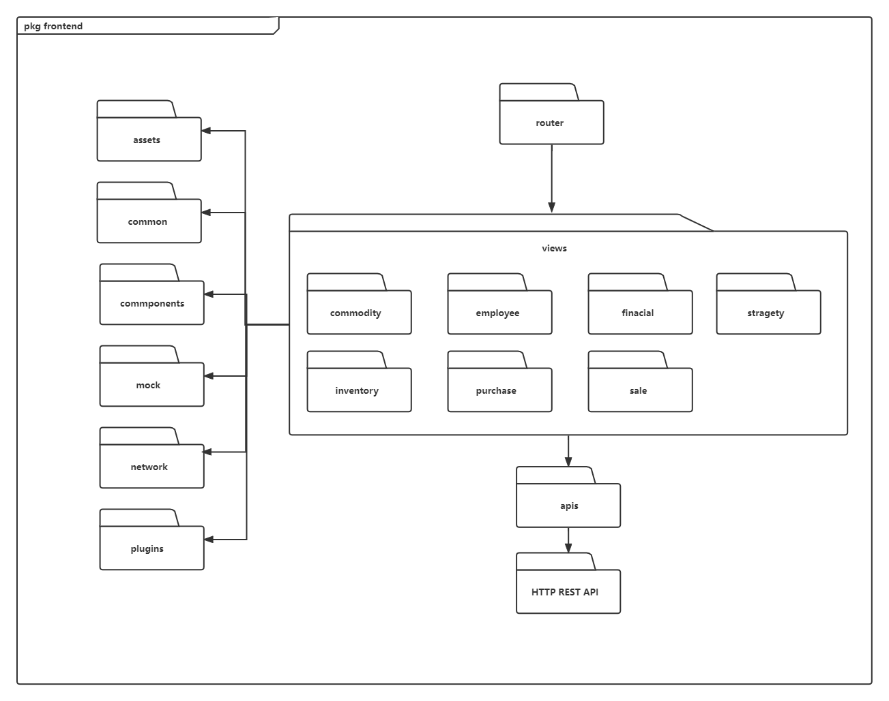

# ERP系统软件体系结构描述文档

> #### 5A652 杨峥 何浩达 赵勇臻 张岳轩
>
> 最后更改于2022/07/06

| 修改人员 | 日期       | 修改原因                             | 版本号 |
| -------- | ---------- | ------------------------------------ | ------ |
| 杨峥     | 2022/07/06 | 财务、人力资源模块接口视角和信息视角 | 1.1    |
|          |            |                                      |        |
|          |            |                                      |        |
| 杨峥     | 2022/07/08 | 年终奖制定补充                       | 1.4    |
|          |            |                                      |        |

## 目录

[toc]

## 1. 引言

> 最后一次修改者：XXX
>
> 最后一次修改日期：2022/07/05

**1.1 编制目的**

本报告详细完成对ERP系统的概要设计，达到指导详细设计和开发的目的，同时实现和测试人员及用户的沟通。

本报告面向开发人员、测试人员及最终用户编写，是了解系统的导航。

**1.2 词汇表**

| 词汇名称 | 词汇含义          | 备注   |
| -------- | ----------------- | ------ |
| ERP      | 本项目开发的系统  | 无     |
| B/S      | 浏览器/服务器架构 | 无     |
| ......   | ......            | ...... |

**1.3 参考资料**

1. 整个ERP系统用例图
2. 库存模块用例描述
3. 销售模块需求规格说明

## 2. 产品描述

> 最后一次修改者：XXX
>
> 最后一次修改日期：2022/07/05

参考ERP系统用例文档和ERP系统软件需求规格说明文档对产品的概括描述。

## 3. 逻辑视角

> 最后一次修改者：XXX
>
> 最后一次修改日期：2022/07/05

ERP系统采用了分层体系结构风格，将系统分为三层（展示层，业务逻辑层，数据层），能够很好地示意整个高层抽象。展示层包含前端页面实现，业务逻辑层包含业务逻辑处理的实现，数据层负责数据持久化和访问。分层体系结构的逻辑视角和逻辑设计方案如下图1和图2所示。


<div align = "center">图1 参照体系结构风格的包图表达逻辑视角</div>

> 最后一次修改者：张岳轩
>
> 最后一次修改日期：2021/07/08


<div align = "center">图2 软件体系结构逻辑设计方案 </div>

## 4. 组成视角

> 最后一次修改者：赵勇臻
>
> 最后一次修改日期：2021/07/07

### 4.1 开发包图

> 下表仅涉及库存管理和销售模块相关部分

<div align = "center"> 表1 ERP系统的最终开发包设计</div>

| 开发（物理）包              | 依赖的其他开发包                                        |
| --------------------------- | ------------------------------------------------------- |
| erp.controller.sales        | erp.vo.salesVo, erp.service.sales, erp.util             |
| erp.service.sales           | erp.vo.salesVo                                          |
| erp.serviceimpl.sales       | erp.mapperservice.sales, erp.po.sales, erp.util         |
| erp.mapperservice.sales     | erp.po.sales                                            |
| erp.po.sales                | erp.vo.salesVo, erp.util                                |
| erp.vo.salesVo              | erp.po.sales, erp.util                                  |
| erp.controller.inventory    | erp.vo.inventoryVo, erp.service.inventory, erp.util     |
| erp.service.inventory       | erp.vo.inventoryVo                                      |
| erp.serviceimpl.inventory   | erp.mapperservice.inventory, erp.po.inventory, erp.util |
| erp.mapperservice.inventory | erp.po.inventory                                        |
| erp.po.inventory            | erp.vo.inventoryVo, erp.util                            |
| erp.vo.inventoryVo          | erp.po.inventory, erp.util                              |
| router                      | views                                                   |
| views                       | assets, common, components, mock, network, plugins      |

> 最后一次修改者：赵勇臻
>
> 最后一次修改日期：2021/07/07



<div align = "center">图3 ERP系统浏览器端开发包图</div>

> 最后一次修改者：张岳轩
>
> 最后一次修改日期：2021/07/08


<div align = "center">图4 ERP系统服务器端开发包图</div>

### 4.2 物理部署

ERP系统采用B/S架构(浏览器/服务器架构)。代码分别部署在FrontendServer（需部署Node.js），BackendServer（需部署JDK，采用springboot框架），dataBaseServer（需部署MySQL）上。


<div align = "center">图5 部署图</div>

## 5. 接口视角

### **5.1 模块的职责**

> 最后一次修改者：杨峥
>
> 最后一次修改日期：2022/07/05

浏览器端和服务器端视图如图6和图7所示。浏览器各层和服务器端各层的职责如表2和表3所示。


<div align = "center">图6 浏览器端模块视图</div>


<div align = "center">图7 服务器端模块视图</div>

<div align = "center">表2 浏览器各层的职责</div>

| 层         | 职责                           |
| ---------- | ------------------------------ |
| 用户界面层 | 负责展示前端界面，并与用户交互 |
| 前端逻辑层 | 负责处理简单业务逻辑           |
| 网络模块   | 通过HTTP REST API与服务端交互  |

<div align = "center">表3 服务器各层的职责</div>

| 层         | 职责                                     |
| ---------- | ---------------------------------------- |
| 网络模块   | 负责HTTP通信服务，为浏览器提供前端资源   |
| 业务逻辑层 | 对从前端和浏览器端发来的请求进行业务处理 |
| 数据层     | 负责数据的持久化以及数据访问接口         |

每一层只是使用下方直接接触的层。层与层之间仅仅是通过接口的调用来完成的。层之间调用的接口如表4所示。

<div align = "center">表4 层之间调用接口</div>

| 接口                                                         | 服务调用方 | 服务提供方 |
| ------------------------------------------------------------ | ---------- | ---------- |
| WarehouseService<br>SaleService<br>FinancialService<br>HRService<br>PromotionService | 前端逻辑层 | 业务逻辑层 |
| WarehouseDao<br/>SalesDao<br/>FinancialDao<br/>HRDao<br/>PromotionDao | 业务逻辑层 | 数据层     |

重点描述库存模块和销售模块相关类的设计，包含库存模块和销售模块的业务逻辑层的接⼝规范和数据层的接⼝规范，和数据库设计。

### 5.2 用户界面层分解

> 最后一次修改者：杨峥
>
> 最后一次修改日期：2022/07/06

根据需求，系统存在40个用户界面：登录界面，进货销售人员主界面，客户管理界面等。如图8所示。


<div align = "center">图8 用户界面跳转</div>

#### 5.2.1 用户界面层模块的职责

| 模块      | 职责                 |
| --------- | -------------------- |
| Warehouse | 显示库存管理页面     |
| Sales     | 显示销售管理页面     |
| Financial | 显示财务管理页面     |
| HR        | 显示人力资源管理页面 |
| Promotion | 显示促销策略管理页面 |

#### 5.2.2 用户界面层模块需要的服务接口

##### 5.2.2.1 Warehouse 模块

<table>  
<table >
<tr>
  <th rowspan="3">Warehouse.api.product.queryAll</th>
</tr>
<tr>
  <td>前置条件</td>
  <td>用户进入仓库管理页面</td>
</tr>
<tr>
  <td>后置条件</td>
  <td>显示所有商品</td>
 <tr>
  <th rowspan="3">Warehouse.api.product.update</th>
</tr>
<tr>
  <td>前置条件</td>
  <td>用户进入仓库管理页面</td>
</tr>
<tr>
  <td>后置条件</td>
  <td>更新商品信息</td>
</tr>
    <th rowspan="3">Warehouse.api.product.create</th>
</tr>
<tr>
  <td>前置条件</td>
  <td>用户进入仓库管理页面</td>
</tr>
<tr>
  <td>后置条件</td>
  <td>创建新商品</td>
</tr>
  <th rowspan="3">Warehouse.api.product.delete</th>
</tr>
<tr>
  <td>前置条件</td>
  <td>用户进入仓库管理页面</td>
</tr>
<tr>
  <td>后置条件</td>
  <td>删除该商品</td>
</tr>
  <th rowspan="3">Warehouse.api.category.queryAll</th>
</tr>
<tr>
  <td>前置条件</td>
  <td>用户进入仓库管理页面</td>
</tr>
<tr>
  <td>后置条件</td>
  <td>显示所有商品分类</td>
</tr>
</tr>
  <th rowspan="3">Warehouse.api.category.create</th>
</tr>
<tr>
  <td>前置条件</td>
  <td>用户进入仓库管理页面</td>
</tr>
<tr>
  <td>后置条件</td>
  <td>创建新商品分类</td>
</tr>
</tr>
  <th rowspan="3">Warehouse.api.category.delete</th>
</tr>
<tr>
  <td>前置条件</td>
  <td>用户进入仓库管理页面</td>
</tr>
<tr>
  <td>后置条件</td>
  <td>删除该商品分类</td>
</tr>
<tr>
  <th rowspan="3">Warehouse.api.category.update</th>
</tr>
<tr>
  <td>前置条件</td>
  <td>用户进入仓库管理页面</td>
</tr>
<tr>
  <td>后置条件</td>
  <td>更新商品信息</td>
</table>

##### 5.2.2.2 Sales 模块


<table>  
<tr>
    <th rowspan="3">Sales.api.customer.query</th>
<tr>
  <td>前置条件</td>
  <td>进入客户管理界面</td>
</tr>
<tr>
  <td>后置条件</td>
  <td>显示查询得出的客户</td>
</tr>
<tr>
    <th rowspan="3">Sales.api.customer.update</th>
<tr>
  <td>前置条件</td>
  <td>进入客户管理界面<td>
</tr>
<tr>
  <td>后置条件</td>
  <td>修改客户信息</td>
</tr>
  <th rowspan="3">Warehouse.api.customer.create</th>
</tr>
<tr>
  <td>前置条件</td>
  <td>用户进入客户管理页面</td>
</tr>
<tr>
  <td>后置条件</td>
  <td>创建新客户</td>
</tr>
</tr>
  <th rowspan="3">Warehouse.api.customer.delete</th>
</tr>
<tr>
  <td>前置条件</td>
  <td>用户进入客户管理页面</td>
</tr>
<tr>
  <td>后置条件</td>
  <td>删除该客户</td>
</tr>
 <tr>
    <th rowspan="3">Sales.api.CommodityInputSheet.send</th>
<tr>
  <td>前置条件</td>
  <td>进入进货单制定界面并填写完成必要信息</td>
</tr>
<tr>
  <td>后置条件</td>
  <td>提交进货单以以供审批</td>
</tr>
 <tr>
    <th rowspan="3">Sales.api.CommodityInputSheet.input</th>
  </tr>
 <tr>
  <td>前置条件</td>
  <td>进入进货单制定界面</td>
</tr>
<tr>
  <td>后置条件</td>
  <td>填写完成进货单相关信息</td>
</tr>
   <tr>
    <th rowspan="3">Sales.api.CommodityInputSheet.update</th>
<tr>
  <td>前置条件</td>
  <td>进入进货单制定界面</td>
</tr>
<tr>
  <td>后置条件</td>
  <td>修改完成进货单有关信息</td>
</tr>
 <tr>
    <th rowspan="3">Sales.api.CommodityOutputSheet.send</th>
<tr>
  <td>前置条件</td>
  <td>进入退货单制定界面并填写完成必要信息</td>
</tr>
<tr>
  <td>后置条件</td>
  <td>提交退货单以以供审批</td>
</tr>
 <tr>
    <th rowspan="3">Sales.api.CommodityOutputSheet.input</th>
  </tr>
 <tr>
  <td>前置条件</td>
  <td>进入退货单制定界面</td>
</tr>
<tr>
  <td>后置条件</td>
  <td>填写完成相关信息</td>
</tr>
   <tr>
    <th rowspan="3">Sales.api.CommodityOutputSheet.update</th>
<tr>
  <td>前置条件</td>
  <td>进入退货单制定界面</td>
</tr>
<tr>
  <td>后置条件</td>
  <td>修改完成退货单有关信息</td>
</tr>
  <tr>
    <th rowspan="3">Sales.api.SalesInputSheet.send</th>
<tr>
  <td>前置条件</td>
  <td>进入表单制定界面并填写完成必要信息</td>
</tr>
<tr>
  <td>后置条件</td>
  <td>提交表单以以供审批</td>
</tr>
 <tr>
    <th rowspan="3">Sales.api.SalesInputSheet.input</th>
  </tr>
 <tr>
  <td>前置条件</td>
  <td>进入退货单制定界面</td>
</tr>
<tr>
  <td>后置条件</td>
  <td>填写完成相关信息</td>
</tr>
   <tr>
    <th rowspan="3">Sales.api.SalesInputSheet.update</th>
<tr>
  <td>前置条件</td>
  <td>进入退货单制定界面</td>
</tr>
<tr>
  <td>后置条件</td>
  <td>修改完成退货单有关信息</td>
</tr>
 <tr>
    <th rowspan="3">Sales.api.SalesOutputSheet.Sheet.send</th>
<tr>
  <td>前置条件</td>
  <td>进入销售单制定界面并填写完成必要信息</td>
</tr>
<tr>
  <td>后置条件</td>
  <td>提交销售单以以供审批</td>
</tr>
 <tr>
    <th rowspan="3">Sales.api.SalesOutputSheet.input</th>
  </tr>
 <tr>
  <td>前置条件</td>
  <td>进入销售单制定界面</td>
</tr>
<tr>
  <td>后置条件</td>
  <td>填写完成相关信息</td>
</tr>
   <tr>
    <th rowspan="3">Sales.api.SalesOutputSheet.update</th>
<tr>
  <td>前置条件</td>
  <td>进入销售单制定界面</td>
</tr>
<tr>
  <td>后置条件</td>
  <td>修改完成销售单单有关信息</td>
</tr>
<tr>
<th rowspan="3">Sales.api.CustomerWithLargestAmount</th>
<tr>
  <td>前置条件</td>
  <td>进入表单制定界面并填写完成必要信息</td>
</tr>
<tr>
  <td>后置条件</td>
  <td>显示所查询销售人员某个时间段成交金额（订单数）最大的客户,系统显示相关信息</td>
</tr>
</table>
##### 5.2.2.3 Financial 模块

<table >
<tr>
  <th rowspan="3">api.account.create</th>
</tr>
<tr>
  <td>前置条件</td>
  <td>用户进入财务管理-账户管理页面</td>
</tr>
<tr>
  <td>后置条件</td>
  <td>填写相关信息，创建新账户</td>
 <tr>
  <th rowspan="3">api.account.delete</th>
</tr>
<tr>
  <td>前置条件</td>
  <td>用户进入财务管理-账户管理页面</td>
</tr>
<tr>
  <td>后置条件</td>
  <td>填写账户名称，将其删除</td>
</tr>
    <th rowspan="3">api.account.findAll</th>
</tr>
<tr>
  <td>前置条件</td>
  <td>用户进入财务管理-账户管理页面</td>
</tr>
<tr>
  <td>后置条件</td>
  <td>显示所有账户信息</td>
</tr>
  <th rowspan="3">api.incomeSheet.sheet-show</th>
</tr>
<tr>
  <td>前置条件</td>
  <td>用户进入财务管理-收款单页面</td>
</tr>
<tr>
  <td>后置条件</td>
  <td>显示所有收款单信息</td>
</tr>
  <th rowspan="3">api.incomeSheet.sheet-make</th>
</tr>
<tr>
  <td>前置条件</td>
  <td>用户进入财务管理-收款单页面</td>
</tr>
<tr>
  <td>后置条件</td>
  <td>填写相关信息，制作收款单</td>
</tr>
</tr>
  <th rowspan="3">api.incomeSheet.approval</th>
</tr>
<tr>
  <td>前置条件</td>
  <td>用户进入财务管理-收款单页面</td>
</tr>
<tr>
  <td>后置条件</td>
  <td>审批收款单</td>
</tr>
</tr>
  <th rowspan="3">api.outcomeSheet.sheet-show</th>
</tr>
<tr>
  <td>前置条件</td>
  <td>用户进入财务管理-付款单页面</td>
</tr>
<tr>
  <td>后置条件</td>
  <td>显示所有付款单信息</td>
</tr>
<tr>
  <th rowspan="3">api.outcomeSheet.sheet-make</th>
</tr>
<tr>
  <td>前置条件</td>
  <td>用户进入财务管理-付款单页面</td>
</tr>
<tr>
  <td>后置条件</td>
  <td>填写相关信息，制作付款单</td>
</tr>
</tr>
  <th rowspan="3">api.outcomeSheet.approval</th>
</tr>
<tr>
  <td>前置条件</td>
  <td>用户进入财务管理-付款单页面</td>
</tr>
<tr>
  <td>后置条件</td>
  <td>审批付款单</td>
</tr>
</tr>
  <th rowspan="3">api.grantSheet.sheet-show</th>
</tr>
<tr>
  <td>前置条件</td>
  <td>用户进入财务管理-工资发放单页面</td>
</tr>
<tr>
  <td>后置条件</td>
  <td>显示所有工资发放单信息</td>
</tr>
<tr>
  <th rowspan="3">api.grantSheet.approval</th>
</tr>
<tr>
  <td>前置条件</td>
  <td>用户进入财务管理-工资发放单页面</td>
</tr>
<tr>
  <td>后置条件</td>
  <td>审批工资发放单</td>
</tr>
</tr>
  <th rowspan="3">api.salesDetail.show-all</th>
</tr>
<tr>
  <td>前置条件</td>
  <td>用户进入财务管理-销售明细页面</td>
</tr>
<tr>
  <td>后置条件</td>
  <td>显示销售明细表</td>
</tr>
<tr>
  <th rowspan="3">api.bsSheet.sheet-show</th>
</tr>
<tr>
  <td>前置条件</td>
  <td>用户进入财务管理-经营情况页面</td>
</tr>
<tr>
  <td>后置条件</td>
  <td>显示经营明细表</td>
</tr>
</table>

##### 5.2.2.4 HR 模块

<table >    
<tr>
  <th rowspan="3">api.employee.createEmployee</th>
</tr>
<tr>
  <td>前置条件</td>
  <td>用户进入人力资源管理-员工管理页面</td>
</tr>
<tr>
  <td>后置条件</td>
  <td>填写相关信息，创建新员工</td>
</tr>    
<tr>
  <th rowspan="3">api.employee.findAllEmployee</th>
</tr>
<tr>
  <td>前置条件</td>
  <td>用户进入人力资源管理-员工管理页面</td>
</tr>
<tr>
  <td>后置条件</td>
  <td>填写员工id，显示员工信息</td>
</tr>
    <th rowspan="3">api.employee.findUser</th>
</tr>
<tr>
  <td>前置条件</td>
  <td>用户进入人力资源管理-员工管理页面</td>
</tr>
<tr>
  <td>后置条件</td>
  <td>填写员工id，显示该员工账户信息</td>
</tr>
  <th rowspan="3">api.employee.signIn</th>
</tr>
<tr>
  <td>前置条件</td>
  <td>用户进入系统主界面</td>
</tr>
<tr>
  <td>后置条件</td>
  <td>无</td>
</tr>
<tr>
  <th rowspan="3">api.employee.findAbsence</th>
</tr>
<tr>
  <td>前置条件</td>
  <td>用户进入人力资源管理-员工管理页面</td>
</tr>
<tr>
  <td>后置条件</td>
  <td>填写账户名，显示缺勤天数</td>
</tr>    
  <th rowspan="3">api.job.findAllJob</th>
</tr>
<tr>
  <td>前置条件</td>
  <td>用户进入人力资源管理-岗位管理页面</td>
</tr>
<tr>
  <td>后置条件</td>
  <td>显示所有岗位信息</td>
</tr>
</tr>
  <th rowspan="3">api.job.updateJob</th>
</tr>
<tr>
  <td>前置条件</td>
  <td>用户进入人力资源管理-岗位管理页面</td>
</tr>
<tr>
  <td>后置条件</td>
  <td>填写岗位信息，并进行更新</td>
</tr>
</tr>
  <th rowspan="3">api.job.findAllCalculateMethod</th>
</tr>
<tr>
  <td>前置条件</td>
  <td>用户进入人力资源管理-岗位管理页面</td>
</tr>
<tr>
  <td>后置条件</td>
  <td>显示所有薪资计算方式</td>
</tr>
<tr>
  <th rowspan="3">api.job.findAllPaymentMethod</th>
</tr>
<tr>
  <td>前置条件</td>
  <td>用户进入人力资源管理-岗位管理页面</td>
</tr>
<tr>
  <td>后置条件</td>
  <td>显示所有薪资发放方式</td>
</tr>
</tr>
  <th rowspan="3">api.salary.sheet-make</th>
</tr>
<tr>
  <td>前置条件</td>
  <td>用户进入人力资源管理-工资单页面</td>
</tr>
<tr>
  <td>后置条件</td>
  <td>填写相关信息，制作工资单</td>
</tr>
</tr>
  <th rowspan="3">api.salary.sheet-show</th>
</tr>
<tr>
  <td>前置条件</td>
  <td>用户进入人力资源管理-工资单页面</td>
</tr>
<tr>
  <td>后置条件</td>
  <td>显示所有工资单信息</td>
</tr>
</tr>
  <th rowspan="3">api.yearEndAwards.findAllYearEndSalary</th>
</tr>
<tr>
  <td>前置条件</td>
  <td>总经理进入人力资源管理-年终奖页面，查看某员工全年工资情况</td>
</tr>
<tr>
  <td>后置条件</td>
  <td>返回该员工全年工资情况</td>
</tr>
</tr>
  <th rowspan="3">api.yearEndAwards.establishYearEndAwards</th>
</tr>
<tr>
  <td>前置条件</td>
  <td>总经理进入人力资源管理-年终奖页面，为某员工制定年终奖</td>
</tr>
<tr>
  <td>后置条件</td>
  <td>年终奖计入该员工12月份工资</td>
</tr>
</table>

##### 5.2.2.5 Promtion 模块

>  最后一次修改者：张岳轩
>
> 最后一次修改日期：2022/07/06

<table >    
<tr>
  <th rowspan="3">api.promotion.user.create</th>
</tr>
<tr>
  <td>前置条件</td>
  <td>总经理进入用户等级促销策略制定页面</td>
</tr>
<tr>
  <td>后置条件</td>
  <td>创建新促销策略</td>
</tr>    
<tr>
  <th rowspan="3">api.promotion.user.show-all</th>
</tr>
<tr>
  <td>前置条件</td>
  <td>总经理进入用户等级促销策略页面</td>
</tr>
<tr>
  <td>后置条件</td>
  <td>显示当前所有用户等级促销策略</td>
</tr>
    <th rowspan="3">api.promotion.price.create</th>
</tr>
<tr>
  <td>前置条件</td>
  <td>总经理进入总价促销策略制定页面</td>
</tr>
<tr>
  <td>后置条件</td>
  <td>创建新促销策略</td>
</tr>
  <th rowspan="3">api.promotion.price.show-all</th>
</tr>
<tr>
  <td>前置条件</td>
  <td>总经理进入总价促销策略页面</td>
</tr>
<tr>
  <td>后置条件</td>
  <td>显示所有总价促销策略</td>
</tr>
<tr>
  <th rowspan="3">api.promotion.package.create</th>
</tr>
<tr>
  <td>前置条件</td>
  <td>总经理进入特价包促销策略制定页面</td>
</tr>
<tr>
  <td>后置条件</td>
  <td>创建新的特价包</td>
</tr>    
  <th rowspan="3">api.promotion.package.show-all</th>
</tr>
<tr>
  <td>前置条件</td>
  <td>总经理进入特价包促销策略页面</td>
</tr>
<tr>
  <td>后置条件</td>
  <td>显示所有特价包</td>
</tr>
</tr>
  <th rowspan="3">api.promotion.coupon.show</th>
</tr>
<tr>
  <td>前置条件</td>
  <td>用户进入代金券查询页面，输入查询的客户id</td>
</tr>
<tr>
  <td>后置条件</td>
  <td>显示该客户拥有的所有代金券</td>
</tr>
</table>

#### 5.2.3 用户界面层模块设计原理

用户界面利用vue来实现。

### 5.3 业务逻辑层分解

> 最后一次修改者：杨峥
>
> 最后一次修改日期：2022/07/06

业务逻辑层包括多个针对界面的业务逻辑处理对象。例如`Warehouse`负责处理库存界面的业务逻辑；`Sales`负责处理销售界面的业务逻辑；`Financial`负责处理财务界面的业务逻辑；`HR`负责处理人力资源界面的业务逻辑

#### 5.3.1 业务逻辑层模块的职责

| 模块             | 职责                                   |
| ---------------- | -------------------------------------- |
| warehouseService | 负责实现对应于库存界面所需要的服务     |
| salesSerivice    | 负责实现销售界面所需要的服务           |
| financialService | 负责实现财务界面的业务逻辑             |
| HRServive        | 负责处理人力资源界面的业务逻辑         |
| promotionService | 负责处理促销策略、代金券界面的业务逻辑 |

#### 5.3.2 业务逻辑层模块的接口规范

<center><b>表 9 warehouseService模块的接口规范</b></center>

<center>提供的服务(供接口)</center>

<table>
<tr>
  <th rowspan="3">CategoryService.createCategory</th>
  <td>语法</td>
  <td>public CategoryVO createCategory(Integer parentId, String name);</td>
</tr>
<tr>
  <td>前置条件</td>
  <td>进入库存管理界面，输入的父结点id,分类名符合输入规则</td>
</tr>
<tr>
  <td>后置条件</td>
  <td>查看是否存在响应父结点，将输入的分类名插入到父结点之下，返回分类信息</td>
</tr>
<tr>
  <th rowspan="3">CategoryService.deleteCategory</th>
  <td>语法</td>
  <td>public void deleteCategory(Integer id);</td>
</tr>
<tr>
  <td>前置条件</td>
  <td>进入库存管理页面，输入的商品分类id符合输入规则</td>
</tr>
<tr>
  <td>后置条件</td>
  <td>查看是否存在该商品分类，如果存在则删除该分类以及其下的所有子分类</td>
</tr>
<tr>
  <th rowspan="3">ProductService.createProduct</th>
  <td>语法</td>
  <td>public ProductInfoVO createProduct(CreateProductVO inputVO);</td>
</tr>
<tr>
  <td>前置条件</td>
  <td>进入库存管理页面，输入的商品信息符合输入规则</td>
</tr>
<tr>
  <td>后置条件</td>
  <td>根据输入的商品信息创建商品，返回商品信息</td>
</tr>  
<tr>
  <th rowspan="3">WarehouseService.productWarehousing</th>
  <td>语法</td>
  <td>public void productWarehousing(WarehouseInputFormVO warehouseInputFormVO);</td>
</tr>
<tr>
  <td>前置条件</td>
  <td>进入库存管理页面，填写符合规则的入库单并提交</td>
</tr>
<tr>
  <td>后置条件</td>
  <td>入库单变为待审批状态</td>
</tr>
</table>
<center>需要的服务(需接口)</center>

| 服务名                                                     | 服务                             |
| ---------------------------------------------------------- | -------------------------------- |
| CategoryDAO.createCategory(CategoryPO categoryPO)          | 根据字段名和值插入单一持久化对象 |
| CategoryDAO.findByCategoryId(Integer categoryId)           | 根据字段名和值查找单一持久化对象 |
| CategoryDAO.findAll()                                      | 查找多个持久化对象               |
| CategoryDAO.updateById(CategoryPO categoryPO)              | 根据字段名和值更新单一持久化对象 |
| WarehouseDao.saveBatch(List\<WarehousePO> warehousePOList) | 在数据库中插入多个对象           |
| WarehouseOutputSheetDao.getLatest()                        | 获取最近一条出库单               |
| WarehouseInputSheetDao.save(WarehouseInputSheetPO toSave)  | 在数据库中插入一个出库单对象     |

<center><b>表 10 salesService模块的接口规范</b></center>

<center>提供的服务(供接口)</center>

<table>
<tr>
  <th rowspan="3">CustomerService.createCustomer</th>
  <td>语法</td>
  <td>public CategoryVO createCategory(CustomerVO);</td>
</tr>
<tr>
  <td>前置条件</td>
  <td>进入销售界面，输入新增客户的信息</td>
</tr>
<tr>
  <td>后置条件</td>
  <td>创建该客户</td>
</tr>
<tr>
  <th rowspan="3">CommodityService.purchasing</th>
  <td>语法</td>
  <td>public void purchasing(CommodityInputFormVO inputVO);</td>
</tr>
<tr>
  <td>前置条件</td>
  <td>进入销售界面, 填写并提交进货单</td>
</tr>
<tr>
  <td>后置条件</td>
  <td>进货单变为待审核状态</td>
</tr>
<tr>
  <th rowspan="3">SalesService.saling</th>
  <td>语法</td>
  <td>public void saling(SalesInputVO inputVO);</td>
</tr>
<tr>
  <td>前置条件</td>
  <td>进入销售界面，填写并提交销售单</td>
</tr>
<tr>
  <td>后置条件</td>
  <td>销售单变为待审核状态</td>
</tr>  
<tr>
  <th rowspan="3">CustomerService.customerWithLargestAmount</th>
  <td>语法</td>
  <td>public CustomerVO customerWithLargestAmount(int id, int begin, int end);</td>
</tr>
<tr>
  <td>前置条件</td>
  <td>进入销售分析页面，输入合法的销售人员id和时间间隔</td>
</tr>
<tr>
  <td>后置条件</td>
  <td>返回该销售人员在该段时间内成交额最大的客户信息</td>
</tr>
</table>
<center>需要的服务(需接口)</center>

| 服务名                                                       | 服务                               |
| ------------------------------------------------------------ | ---------------------------------- |
| CustomerDAO.createCustomer(CustomerPO customerPO)            | 根据字段名和值插入单一持久化对象   |
| CommodityInputSheetDao.getLatest()                           | 获取最近一条进货单                 |
| CommodityOutputSheetDao.save(CommodityOutputFormPO outputPO) | 根据字段名和值插入单一持久化对象   |
| SalesInputSheetDao.saveBatch(List\<SalesInputPO> salesPOList) | 在数据库中插入多个对象             |
| CustomerDAO.getCustomerWithLargestAmount(int id, int begin, int end) | 在数据库中检索符合条件的持久化对象 |

<center><b>表 11 financialService模块的接口规范</b></center>

<center>提供的服务(供接口)</center>

<table>
    <tr>
  <th rowspan="3">BankAccountService.createBankAccount</th>
  <td>语法</td>
  <td>BankAccountVO createBankAccount(BankAccountVO inputVO)</td>
</tr>
<tr>
  <td>前置条件</td>
  <td>用户进入财务管理-账户管理界面，输入账户信息</td>
</tr>
<tr>
  <td>后置条件</td>
  <td>创建该账户</td>
</tr>
<tr>
  <th rowspan="3">BankAccountService.delete</th>
  <td>语法</td>
  <td>void delete(String accountName)</td>
</tr>
<tr>
  <td>前置条件</td>
  <td>用户进入财务管理-账户管理界面，选择要删除的账户</td>
</tr>
<tr>
  <td>后置条件</td>
  <td>根据用户名，删除该账户</td>
</tr>
<tr>
  <th rowspan="3">BankAccountService.findAll</th>
  <td>语法</td>
  <td>List<BankAccountVO> findAll()</td>
</tr>
<tr>
  <td>前置条件</td>
  <td>用户进入财务管理-账户管理界面，查询全部账户信息</td>
</tr>
<tr>
  <td>后置条件</td>
  <td>返回全部账户信息</td>
</tr>
<tr>
  <th rowspan="3">IncomeService.makeIncomeSheet</th>
  <td>语法</td>
  <td>void makeIncomeSheet(UserVO userVO, IncomeSheetVO incomeSheetVO)</td>
</tr>
<tr>
  <td>前置条件</td>
  <td>用户进入财务管理界面，选择客户并输入收款单信息</td>
</tr>
<tr>
  <td>后置条件</td>
  <td>创建该收款单</td>
</tr>
<tr>
  <th rowspan="3">IncomeService.approval</th>
  <td>语法</td>
  <td>void approval(String id, IncomeSheetState state)</td>
</tr>
<tr>
  <td>前置条件</td>
  <td>该收款单目前处于待审批状态</td>
</tr>
<tr>
  <td>后置条件</td>
  <td>总经理审批，并将其状态改为“审批成功”或“审批失败”</td>
</tr>
    <tr>
  <th rowspan="3">IncomeService.getSheetByState</th>
  <td>语法</td>
  <td>List<IncomeSheetVO> getSheetByState(IncomeSheetState incomeSheetState)</td>
</tr>
<tr>
  <td>前置条件</td>
  <td>用户进入财务管理-收款单界面，输入审批状态查询单据信息</td>
</tr>
<tr>
  <td>后置条件</td>
  <td>返回符合审批状态的单据信息</td>
</tr>
<tr>
  <th rowspan="3">OutcomeService.makeOutcomeSheet</th>
  <td>语法</td>
  <td>void makeOutcomeSheet(UserVO userVO, OutcomeSheetVO outcomeSheetVO)</td>
</tr>
<tr>
  <td>前置条件</td>
  <td>用户进入财务管理界面，选择客户并输入付款单信息</td>
</tr>
<tr>
  <td>后置条件</td>
  <td>创建该付款单</td>
</tr>
<tr>
  <th rowspan="3">OutcomeService.approval</th>
  <td>语法</td>
  <td>void approval(String id, OutcomeSheetState state)</td>
</tr>
<tr>
  <td>前置条件</td>
  <td>该付款单目前处于待审批状态</td>
</tr>
<tr>
  <td>后置条件</td>
  <td>总经理审批，并将其状态改为“审批成功”或“审批失败”</td>
</tr>
<tr>
  <th rowspan="3">OutcomeService.getSheetByState</th>
  <td>语法</td>
  <td>List<OutcomeSheetVO> getSheetByState(OutcomeSheetState OutcomeSheetState)</td>
</tr>
<tr>
  <td>前置条件</td>
  <td>用户进入财务管理-付款单界面，输入审批状态查询单据信息</td>
</tr>
<tr>
  <td>后置条件</td>
  <td>返回符合审批状态的单据信息</td>
</tr>
<tr>
  <th rowspan="3">SalaryGrantService.approval</th>
  <td>语法</td>
  <td>void approval(String id, SalaryGrantSheetState state)</td>
</tr>
<tr>
  <td>前置条件</td>
  <td>对应工资单通过审批，自动生成工资发放单</td>
</tr>
<tr>
  <td>后置条件</td>
  <td>总经理审批，并将其状态改为“审批成功”或“审批失败”</td>
</tr>  
<tr>
  <th rowspan="3">SalaryGrantService.getSheetByState</th>
  <td>语法</td>
  <td>List<SalaryGrantSheet> getSheetByState(SalaryGrantSheetState salaryGrantSheetState)</td>
</tr>
<tr>
  <td>前置条件</td>
  <td>用户进入财务管理-工资发放单界面，输入审批状态查询单据信息</td>
</tr>
<tr>
  <td>后置条件</td>
  <td>返回符合审批状态的单据信息</td>
</tr>     
<tr>
  <th rowspan="3">BusinessSituationService.getBusinessSituationByTime</th>
  <td>语法</td>
  <td>BusinessSituationVO getBusinessSituationByTime(String beginDateStr, String endDateStr)</td>
</tr>
<tr>
  <td>前置条件</td>
  <td>用户进入财务管理界面，输入查询的时间范围</td>
</tr>
<tr>
  <td>后置条件</td>
  <td>返回此时间段内的经营情况表</td>
</tr>  
<tr>
  <th rowspan="3">SaleDetailService.findAllRecords</th>
  <td>语法</td>
  <td>List<SaleRecordVO> findAllRecords()</td>
</tr>
<tr>
  <td>前置条件</td>
  <td>用户进入财务管理-销售明细界面，查询全部销售明细</td>
</tr>
<tr>
  <td>后置条件</td>
  <td>返回全部销售明细</td>
</tr>      
</table>
<center>需要的服务(需接口)</center>

| 服务名                                                       | 服务                                                     |
| ------------------------------------------------------------ | -------------------------------------------------------- |
| BankAccountDao.createBankAccount(BankAccountPO bankAccountPO) | 创建单一公司银行账户持久化对象                           |
| BankAccountDao.deleteOneByAccountName(String accountName)    | 根据账户名，删除单一公司银行账户持久化对象               |
| BankAccountDao.findAll()                                     | 查询全部公司银行账户持久化对象                           |
| BankAccountDao.findOneByAccountName(String accountName)      | 根据账户名，查询单一公司银行账户持久化对象               |
| IncomeSheetDao.getLatest()                                   | 获取最后一条收款单持久化对象                             |
| IncomeSheetDao.saveSheet(IncomeSheetPO incomeSheetPO)        | 将一个收款单保存为持久化对象                             |
| IncomeSheetDao.saveBatchSheetContent(List\<IncomeSheetContentPO> saveList) | 保存收款单转账列表                                       |
| IncomeSheetDao.findAll()                                     | 查询全部收款单持久化对象                                 |
| IncomeSheetDao.findAllByState(IncomeSheetState incomeSheetState) | 根据审批状态，查询全部符合审批状态的收款单持久化对象     |
| IncomeSheetDao.findContentBySheetId(String incomeSheetId)    | 根据单据编号，查询对应转账列表                           |
| IncomeSheetDao.getSheetById(String id)                       | 根据单据编号，查询单一收款单持久化对象                   |
| IncomeSheetDao.updateState(String id, IncomeSheetState state) | 更新收款单单一持久化对象                                 |
| OutcomeSheetDao.getLatest()                                  | 获取最后一条付款单持久化对象                             |
| OutcomeSheetDao.saveSheet(OutcomeSheetPO outcomeSheetPO)     | 将一个付款单保存为持久化对象                             |
| OutcomeSheetDao.saveBatchSheetContent(List\<OutcomeSheetContentPO> saveList) | 保存付款单条目清单                                       |
| OutcomeSheetDao.findAll()                                    | 查询全部付款单持久化对象                                 |
| OutcomeSheetDao.findAllByState(OutcomeSheetState outcomeSheetState) | 根据审批状态，查询全部符合审批状态的付款单持久化对象     |
| OutcomeSheetDao.findContentBySheetId(String outcomeSheetId)  | 根据单据编号，查询对应条目清单                           |
| OutcomeSheetDao.getSheetById(String id)                      | 根据单据编号，查询单一付款单持久化对象                   |
| OutcomeSheetDao.updateState(String id, OutcomeSheetState outcomeSheetState) | 更新付款单单一持久化对象                                 |
| SalaryGrantSheetDao.getLatest()                              | 获取最后一条工资发放单单持久化对象                       |
| SalaryGrantSheetDao.saveSheet(SalaryGrantSheetPO toSave)     | 将一个工资发放单保存为持久化对象                         |
| SalaryGrantSheetDao.findAll()                                | 查询全部工资发放单持久化对象                             |
| SalaryGrantSheetDao.findAllByState(SalaryGrantSheetState state) | 根据审批状态，查询全部符合审批状态的工资发放单持久化对象 |
| SalaryGrantSheetDao.getSheetById(String id)                  | 根据单据编号，查询单一工资发放单持久化对象               |
| SalaryGrantSheetDao.updateState(String id, SalaryGrantSheetState state) | 更新工资发放单单一持久化对象                             |

<center><b>表 12 HRService模块的接口规范</b></center>

<center>提供的服务(供接口)</center>

<table>
    <tr>
  <th rowspan="3">EmployeeService.createEmployee</th>
  <td>语法</td>
  <td>EmployeeVO createEmployee(EmployeeVO inputVO)</td>
</tr>
<tr>
  <td>前置条件</td>
  <td>用户进入人力资源-员工管理界面，填写新增员工信息</td>
</tr>
<tr>
  <td>后置条件</td>
  <td>创建该员工</td>
</tr>
<tr>
  <th rowspan="3">EmployeeService.findAll</th>
  <td>语法</td>
  <td>List<EmployeeVO> findAll()</td>
</tr>
<tr>
  <td>前置条件</td>
  <td>用户进入人力资源-员工管理界面，查询全部员工信息</td>
</tr>
<tr>
  <td>后置条件</td>
  <td>返回全部员工信息</td>
</tr>
<tr>
  <th rowspan="3">EmployeeService.findUserByEmployeeId</th>
  <td>语法</td>
  <td>UserVO findUserByEmployeeId(Integer id)</td>
</tr>
<tr>
  <td>前置条件</td>
  <td>进入人力资源-员工管理界面，输入员工id</td>
</tr>
<tr>
  <td>后置条件</td>
  <td>查询并返回对应员工id的账户</td>
</tr>  
<tr>
  <th rowspan="3">EmployeeService.signIn</th>
  <td>语法</td>
  <td>void signIn(String username)</td>
</tr>
<tr>
  <td>前置条件</td>
  <td>用户进入主界面，点击打卡</td>
</tr>
<tr>
  <td>后置条件</td>
  <td>如果该员工今日是第一次打卡，则打卡次数+1；否则打卡不成功</td>
</tr>
<tr>
  <th rowspan="3">EmployeeService.findAbsence</th>
  <td>语法</td>
  <td>int findAbsence(String username)</td>
</tr>
<tr>
  <td>前置条件</td>
  <td>进入人力资源-员工管理界面，查询缺勤天数</td>
</tr>
<tr>
  <td>后置条件</td>
  <td>根据当前日期和打卡次数计算出缺勤天数</td>
</tr>
<tr>
  <th rowspan="3">JobService.findAll</th>
  <td>语法</td>
  <td>List<JobVO> findAll()</td>
</tr>
<tr>
  <td>前置条件</td>
  <td>用户进入人力资源-员工管理界面，查询全部岗位信息</td>
</tr>
<tr>
  <td>后置条件</td>
  <td>返回全部岗位信息</td>
</tr>
<tr>
  <th rowspan="3">JobService.updateJob</th>
  <td>语法</td>
  <td>void updateJob(JobPO jobPO)</td>
</tr>
<tr>
  <td>前置条件</td>
  <td>用户进入人力资源-员工管理界面，填写某岗位信息</td>
</tr>
<tr>
  <td>后置条件</td>
  <td>更新对应岗位信息</td>
</tr>
<tr>
  <th rowspan="3">JobService.findAllCalculateMethod</th>
  <td>语法</td>
  <td>List<String> findAllCalculateMethod()</td>
</tr>
<tr>
  <td>前置条件</td>
  <td>用户进入人力资源-员工管理界面，查询全部薪资计算方式</td>
</tr>
<tr>
  <td>后置条件</td>
  <td>返回全部薪资计算方式</td>
</tr>
<tr>
  <th rowspan="3">JobService.findAllPaymentMethod</th>
  <td>语法</td>
  <td>List<PaymentMethod> findAllPaymentMethod()</td>
</tr>
<tr>
  <td>前置条件</td>
  <td>用户进入人力资源-员工管理界面，查询全部薪资发放方式</td>
</tr>
<tr>
  <td>后置条件</td>
  <td>返回全部薪资发放方式</td>
</tr>
<tr>
  <th rowspan="3">SalaryService.getSheetByState</th>
  <td>语法</td>
  <td>List<SalarySheet> getSheetByState(SalarySheetState state)</td>
</tr>
<tr>
  <td>前置条件</td>
  <td>用户进入人力资源-工资单界面，输入状态查询单据</td>
</tr>
<tr>
  <td>后置条件</td>
  <td>返回符合条件的工资单信息</td>
</tr> 
<tr>
  <th rowspan="3">SalaryService.approval</th>
  <td>语法</td>
  <td>approval(String id, SalarySheetState state)</td>
</tr>
<tr>
  <td>前置条件</td>
  <td>进入人力资源-工资界面，审批工资单</td>
</tr>
<tr>
  <td>后置条件</td>
  <td>修改审批状态；如审批成功，自动生成工资发放单</td>
</tr>
<tr>
  <th rowspan="3">YearEndAwardsService.establishYearEndAwards</th>
  <td>语法</td>
  <td>void establishYearEndAwards(Integer employeeId, BigDecimal awards)</td>
</tr>
<tr>
  <td>前置条件</td>
  <td>总经理进入人力资源-年终奖界面，输入员工id和年终奖</td>
</tr>
<tr>
  <td>后置条件</td>
  <td>年终奖计入对应员工12月份工资</td>
</tr> 
<tr>
  <th rowspan="3">YearEndAwardsService.findAllYearEndSalary</th>
  <td>语法</td>
  <td>List<YearEndAwardsVO> findAllYearEndSalary()</td>
</tr>
<tr>
  <td>前置条件</td>
  <td>总经理进入人力资源-年终奖界面</td>
</tr>
<tr>
  <td>后置条件</td>
  <td>显示所有员工全年工资情况</td>
</tr>    
</table>


<center>需要的服务(需接口)</center>

| 服务名                                                       | 服务                                         |
| ------------------------------------------------------------ | -------------------------------------------- |
| EmployeeDao.createEmployee(EmployeePO employeePO)            | 创建单一员工持久化对象                       |
| EmployeeDao.findAll()                                        | 查找全部员工持久化对象                       |
| EmployeeDao.findUserByEmployeeId(Integer id)                 | 根据员工id，查找对应的账户持久化对象         |
| EmployeeDao.findOneById(int id)                              | 根据员工id，查找单一员工持久化对象           |
| EmployeeDao.signIn(String username)                          | 根据用户名，使对应员工打卡次数+1             |
| EmployeeDao.findSignInTimes(String username)                 | 根据用户名，查询对应员工累计打卡次数         |
| JobDao.findAll()                                             | 查找全部岗位持久化对象                       |
| JobDao.update(JobPO jobPO)                                   | 更新单一岗位持久化对象                       |
| JobDao.findJobByKey(String name, Integer level)              | 根据用户名和岗位级别，查找单一岗位持久化对象 |
| JobDao.findJobByEmployee(Integer employeeId)                 | 根据员工id，查找对应的岗位持久化对象         |
| JobDao.findAllPaymentMethod()                                | 查询全部薪资发放方式                         |
| SalarySheetDao.getLatest()                                   | 获取最近一条工资单持久化对象                 |
| SalarySheetDao.saveSheet(SalarySheetPO toSave)               | 将一个工资单保存为持久化对象                 |
| SalarySheetDao.getSheetById(String id)                       | 根据审批状态，查找对应的工资单持久化对象     |
| SalarySheetDao.findAll()                                     | 查找全部工资单持久化对象                     |
| SalarySheetDao.findAllByState(SalarySheetState state)        | 根据审批状态，查找符合条件的工资单持久化对象 |
| SalarySheetDao.updateState(String id, SalarySheetState state) | 根据工资单id，更新单一持久化对象             |
| YearEndAwardsDao.findById(Integer employeeId)                | 根据员工id，查找单一年终奖持久化对象         |
| YearEndAwardsDao.create(YearEndAwardsPO yearEndAwardsPO)     | 创建单一年终奖持久化对象                     |
| YearEndAwardsDao.findAll()                                   | 查找全部年终奖持久化对象                     |
| YearEndAwardsDao.addAwards(Integer employeeId, BigDecimal awards) | 根据员工id和金额，为其设置年终奖             |

<center><b>表 13 PromotionService模块的接口规范</b></center>

<center>提供的服务(供接口)</center>

<table>
    <tr>
  <th rowspan="3">PromotionService.createUserStrategy</th>
  <td>语法</td>
  <td>void createUserStrategy(UserStrategyVO userStrategyVO)</td>
</tr>
<tr>
  <td>前置条件</td>
  <td>总经理进入用户等级促销策略制定界面</td>
</tr>
<tr>
  <td>后置条件</td>
  <td>创建该促销策略</td>
</tr>
<tr>
  <th rowspan="3">PromotionService.createPriceStrategy</th>
  <td>语法</td>
  <td>void createPriceStrategy(PriceStrategyVO priceStrategyVO)</td>
</tr>
<tr>
  <td>前置条件</td>
  <td>总经理进入总价促销策略制定界面</td>
</tr>
<tr>
  <td>后置条件</td>
  <td>创建该促销策略</td>
</tr>
<tr>
  <th rowspan="3">PromotionService.createPackageStrategy</th>
  <td>语法</td>
  <td>void createPackageStrategy(PackageStrategyVO packageStrategyVO)</td>
</tr>
<tr>
  <td>前置条件</td>
  <td>总经理进入特价包促销策略制定界面</td>
</tr>
<tr>
  <td>后置条件</td>
  <td>创建该促销策略</td>
</tr>  
<tr>
  <th rowspan="3">PromotionService.getAllUserStrategy</th>
  <td>语法</td>
  <td>List<UserStrategyVO> getAllUserStrategy()</td>
</tr>
<tr>
  <td>前置条件</td>
  <td>总经理进入用户等级促销策略显示页面</td>
</tr>
<tr>
  <td>后置条件</td>
  <td>显示所有用户促销策略</td>
</tr>
<tr>
  <th rowspan="3">PromotionService.getAllUserStrategy</th>
  <td>语法</td>
  <td>List<PriceStrategyVO> getAllPriceStrategy()</td>
</tr>
<tr>
  <td>前置条件</td>
  <td>总经理进入用户等级促销策略显示页面</td>
</tr>
<tr>
  <td>后置条件</td>
  <td>显示所有总价促销策略</td>
</tr>
<tr>
  <th rowspan="3">PromotionService.getAllUserStrategy</th>
  <td>语法</td>
  <td>List<PriceStrategyVO> getAllPriceStrategy()</td>
</tr>
<tr>
  <td>前置条件</td>
  <td>总经理进入用户等级促销策略显示页面</td>
</tr>
<tr>
  <td>后置条件</td>
  <td>显示所有特价包促销策略</td>
</tr>
</table>

### 5.4 数据层分解

> 最后一次修改者：杨峥
>
> 最后一次修改日期：2022/07/06

数据层主要给业务逻辑层提供数据访问服务。

#### 5.4.1 库存模块

库存模块的业务逻辑层需要的服务由WarehouseDao接口提供，具体描述如下图所示。


<div align = "center">库存模块数据层模块的描述</div>

##### 5.4.1.1 数据层模块的职责

| 模块                    | 职责                                             |
| ----------------------- | ------------------------------------------------ |
| CategoryDao             | 商品分类管理接口，提供商品分类增、删、改、查服务 |
| ProductDao              | 商品管理接口，提供商品分类增、删、改、查服务     |
| UserDao                 | 用户接口，提供创建、查询用户服务                 |
| WarehouseDao            | 库存接口，提供批量保存、扣除数量、按序查找服务   |
| WarehouseInputSheetDao  | 入库单接口，提供获取、存入功能                   |
| WarehouseOutputSheetDao | 出库单接口，提供获取、存入功能                   |

##### 5.4.1.2  数据层模块的接口规范

<table >
<tr>
  <th rowspan="3">CategoryDao.createCategory</th>
  <td>语法</td>
  <td>CategoryDao.createCategory(CategoryPO categoryPO);</td>
</tr>
<tr>
  <td>前置条件</td>
  <td>该条目在商品分类数据库中不存在</td>
</tr>
<tr>
  <td>后置条件</td>
  <td>在数据库中增加该商品分类条目</td>
</tr>
<tr>
  <th rowspan="3">CategoryDao.findByCategoryId</th>
  <td>语法</td>
  <td>CategoryDao.findByCategoryId(Integer categoryId);</td>
</tr>
<tr>
  <td>前置条件</td>
  <td>数据库中存在该商品分类</td>
</tr>
<tr>
  <td>后置条件</td>
  <td>在数据库中根据ID查询并返回该商品分类</td>
</tr>
<tr>
  <th rowspan="3">CategoryDao.findAll</th>
  <td>语法</td>
  <td>CategoryDao.findAll();</td>
</tr>
<tr>
  <td>前置条件</td>
  <td>无</td>
</tr>
<tr>
  <td>后置条件</td>
  <td>返回所有商品分类</td>
</tr>
    <tr>
  <th rowspan="3">CategoryDao.updateById</th>
  <td>语法</td>
  <td>CategoryDao.updateById();</td>
</tr>
<tr>
  <td>前置条件</td>
  <td>在数据库中存在相同ID的categoryPO</td>
</tr>
<tr>
  <td>后置条件</td>
  <td>更新该PO</td>
</tr>
<tr>
  <th rowspan="3">CategoryDao.deleteById</th>
  <td>语法</td>
  <td>CategoryDao.deleteById(Integer id);</td>
</tr>
<tr>
  <td>前置条件</td>
  <td>在数据库中存在相同ID的categoryPO</td>
</tr>
<tr>
  <td>后置条件</td>
  <td>删除该PO</td>
</tr>
<tr>
  <th rowspan="3">ProductDao.createProduct</th>
  <td>语法</td>
  <td>ProductDao.createProduct(ProductPO productPO);</td>
</tr>
<tr>
  <td>前置条件</td>
  <td>同样ID的PO在数据库中不存在</td>
</tr>
<tr>
  <td>后置条件</td>
  <td>在数据库中增加一个productPO记录</td>
</tr>    
<tr>
  <th rowspan="3">ProductDao.updateById</th>
  <td>语法</td>
  <td>ProductDao.updateById(ProductPO productPO);</td>
</tr>
<tr>
  <td>前置条件</td>
  <td>在数据库中存在相同ID的productPO</td>
</tr>
<tr>
  <td>后置条件</td>
  <td>更新该PO</td>
</tr>    
<tr>
  <th rowspan="3">ProductDao.deleteById</th>
  <td>语法</td>
  <td>ProductDao.deleteById(String id);</td>
</tr>
<tr>
  <td>前置条件</td>
  <td>在数据库中存在相同ID的productPO</td>
</tr>
<tr>
  <td>后置条件</td>
  <td>删除该PO</td>
</tr>    
<tr>
  <th rowspan="3">ProductDao.findById</th>
  <td>语法</td>
  <td>ProductDao.findById(String id);</td>
</tr>
<tr>
  <td>前置条件</td>
  <td>数据库中存在该商品</td>
</tr>
<tr>
  <td>后置条件</td>
  <td>在数据库中根据ID查询并返回该productPO</td>
</tr>    
<tr>
  <th rowspan="3">ProductDao.findAll</th>
  <td>语法</td>
  <td>ProductDao.findAll();</td>
</tr>
<tr>
  <td>前置条件</td>
  <td>无</td>
</tr>
<tr>
  <td>后置条件</td>
  <td>返回所有productPO列表</td>
</tr>      
<tr>
  <th rowspan="3">UserDao.createUser</th>
  <td>语法</td>
  <td>UserDao.createUser(User user);</td>
</tr>
<tr>
  <td>前置条件</td>
  <td>同样ID的User在数据库中不存在</td>
</tr>
<tr>
  <td>后置条件</td>
  <td>在数据库中创建一个User</td>
</tr>     
<tr>
  <th rowspan="3">UserDao.findByUsernameAndPassword</th>
  <td>语法</td>
  <td>UserDao.findByUsernameAndPassword(String username, String password);</td>
</tr>
<tr>
  <td>前置条件</td>
  <td>无</td>
</tr>
<tr>
  <td>后置条件</td>
  <td>根据username和password返回该user信息</td>
</tr>      
<tr>
  <th rowspan="3">WarehouseInputSheetDao.getLatest</th>
  <td>语法</td>
  <td>WarehouseInputSheetDao.getLatest();</td>
</tr>
<tr>
  <td>前置条件</td>
  <td>无</td>
</tr>
<tr>
  <td>后置条件</td>
  <td>获取最近一条入库单</td>
</tr>         
<tr>
  <th rowspan="3">WarehouseInputSheetDao.save</th>
  <td>语法</td>
  <td>WarehouseInputSheetDao.save(WarehouseInputSheetPO toSave);</td>
</tr>
<tr>
  <td>前置条件</td>
  <td>无</td>
</tr>
<tr>
  <td>后置条件</td>
  <td>存入一条入库单记录</td>
</tr>      
<tr>
  <th rowspan="3">WarehouseInputSheetDao.saveBatch</th>
  <td>语法</td>
  <td>WarehouseInputSheetDao.saveBatch(List<WarehouseInputSheetContentPO> warehouseInputListPOSheetContent);</td>
</tr>
<tr>
  <td>前置条件</td>
  <td>无</td>
</tr>
<tr>
  <td>后置条件</td>
  <td>把入库单上的具体内容存入数据库</td>
</tr>         
<tr>
  <th rowspan="3">WarehouseDao.saveBatch</th>
  <td>语法</td>
  <td>WarehouseDao.saveBatch(List<WarehousePO> warehousePOList);</td>
</tr>
<tr>
  <td>前置条件</td>
  <td>无</td>
</tr>
<tr>
  <td>后置条件</td>
  <td>批量保存</td>
</tr>      
<tr>
  <th rowspan="3">WarehouseDao.deductQuantity</th>
  <td>语法</td>
  <td>WarehouseDao.deductQuantity(WarehousePO warehousePO);</td>
</tr>
<tr>
  <td>前置条件</td>
  <td>库存中相应商品数量不为0</td>
</tr>
<tr>
  <td>后置条件</td>
  <td>扣除相应数量</td>
</tr>         
</table>    
注：出库单接口规范和入库单接口规范除了把入库单换成出库单以外没有任何区别，因此不再赘述。

#### 5.4.2 销售模块

销售模块的业务逻辑层需要的服务由SalesDao接口提供，具体描述如下图所示。


<div align = "center">销售模块数据层模块的描述</div>

##### 5.4.2.1 数据层模块的职责

| 模块                   | 职责                                                     |
| ---------------------- | -------------------------------------------------------- |
| CustomerDao            | 客户信息管理接口，提供客户信息的增、删、改、查服务       |
| SalesInputSheetDao     | 销售单据管理接口，提供销售单据批量保存和获取功能         |
| SalesOuputSheetDao     | 销售退货单据管理接口，提供销售退货单据批量保存和获取功能 |
| CommodityInputSheetDao | 进货单据管理接口，提供进货单据批量保存和获取功能         |
| CommodityOuputSheetDao | 进货退货单据管理接口，提供进货退货单据批量保存和获取功能 |

##### 5.4.2.2 数据层模块的接口规范

<table>
<tr>
  <th rowspan="3">CustomerDao</th>
  <td>语法</td>
  <td>CustomerDao.createCustomer(CustomerPO customerPO);</td>
</tr>
<tr>
  <td>前置条件</td>
  <td>该客户在系统中不存在</td>
</tr>
<tr>
  <td>后置条件</td>
  <td>在数据库中增加该客户信息条目</td>
</tr>
<tr>
  <th rowspan="3">CommodityInputSheetDao</th>
  <td>语法</td>
  <td>CommodityInputSheetDao.getLatest();</td>
</tr>
<tr>
  <td>前置条件</td>
  <td>无</td>
</tr>
<tr>
  <td>后置条件</td>
  <td>获取最近一条进货单</td>
</tr>
<tr>
  <th rowspan="3">CommodityOutputSheetDao</th>
  <td>语法</td>
  <td>CommodityOutputSheetDao.save(CommodityOutputFormPO outputPO);</td>
</tr>
<tr>
  <td>前置条件</td>
  <td>无</td>
</tr>
<tr>
  <td>后置条件</td>
  <td>存入一条进货退货单</td>
</tr>
<tr>
  <th rowspan="3">SalesInputSheetDao</th>
  <td>语法</td>
  <td>SalesInputSheetDao.saveBatch(List<SalesInputPO> salesPOList)</td>
</tr>
<tr>
  <td>前置条件</td>
  <td>无</td>
</tr>
<tr>
  <td>后置条件</td>
  <td>在数据库中批量存储一批销售单的内容</td>
</tr>
<tr>
  <th rowspan="3">CustomerDao</th>
  <td>语法</td>
  <td>CustomerDao.getCustomerWithLargestAmount(int id, int begin, int end)</td>
</tr>
<tr>
  <td>前置条件</td>
  <td>无</td>
</tr>
<tr>
  <td>后置条件</td>
  <td>获取一段时间内最大交易量的客户的信息</td>
</tr>
</table>
#### 5.4.3 财务模块

财务模块的业务逻辑层需要的服务由FinancialDao接口提供，具体描述如下图所示。


<div align = "center">财务模块数据层模块的描述</div>

##### 5.4.3.1 数据层模块的职责

| 模块                | 职责                                                         |
| ------------------- | ------------------------------------------------------------ |
| BankAccountDao      | 公司银行账户管理接口，提供银行账户信息的增加、删除和查询服务 |
| IncomeSheetDao      | 收款单管理接口，提供收款单的增加、修改、删除以及按id/state/批量查询服务 |
| OutcomeSheetDao     | 付款单管理接口，基本同于收款单，只是这个是付款的             |
| SalaryGrantSheetDao | 工资发放单管理接口，提供工资发放单的增加、修改、删除以及按id/state/批量查询服务 |

##### 5.4.3.2 数据层模块的接口规范

<table >
<tr>
  <th rowspan="3">BankAccountDao.createBankAccount</th>
  <td>语法</td>
  <td>BankAccountDao.createBankAccount(BankAccountPO bankAccountPO);</td>
</tr>
<tr>
  <td>前置条件</td>
  <td>该条目在银行账户数据库中不存在</td>
</tr>
<tr>
  <td>后置条件</td>
  <td>在数据库中增加该银行账户条目</td>
</tr>
<tr>
  <th rowspan="3">BankAccountDao.findOneByAccountName</th>
  <td>语法</td>
  <td>BankAccountDao.findOneByAccountName(String accountName);</td>
</tr>
<tr>
  <td>前置条件</td>
  <td>数据库中存在该银行账户</td>
</tr>
<tr>
  <td>后置条件</td>
  <td>在数据库中根据account_name查询并返回该商品分类</td>
</tr>
<tr>
  <th rowspan="3">BankAccountDao.findAll</th>
  <td>语法</td>
  <td>BankAccountDao.findAll();</td>
</tr>
<tr>
  <td>前置条件</td>
  <td>无</td>
</tr>
<tr>
  <td>后置条件</td>
  <td>返回所有银行账户信息</td>
</tr>
    <tr>
  <th rowspan="3">BankAccountDao.deleteOneByAccountName</th>
  <td>语法</td>
  <td>BankAccountDao.deleteOneByAccountName(String accountName);</td>
</tr>
<tr>
  <td>前置条件</td>
  <td>在数据库中存在相同account_name的BankAccountPO</td>
</tr>
<tr>
  <td>后置条件</td>
  <td>删除该PO</td>
</tr>
<tr>
  <th rowspan="3">IncomeSheetDao.saveSheet</th>
  <td>语法</td>
  <td>IncomeSheetDao.saveSheet(IncomeSheetPO incomeSheetPO);</td>
</tr>
<tr>
  <td>前置条件</td>
  <td>无</td>
</tr>
<tr>
  <td>后置条件</td>
  <td>将提供的PO保存至数据库</td>
</tr>
<tr>
  <th rowspan="3">IncomeSheetDao.saveBatchSheetContent</th>
  <td>语法</td>
  <td>IncomeSheetDao.saveBatchSheetContent(List<IncomeSheetContentPO> saveList);</td>
</tr>
<tr>
  <td>前置条件</td>
  <td>无</td>
</tr>
<tr>
  <td>后置条件</td>
  <td>将提供的条目清单实体保存至数据库</td>
</tr>    
<tr>
  <th rowspan="3">IncomeSheetDao.findAllByState</th>
  <td>语法</td>
  <td>IncomeSheetDao.findAllByState(IncomeSheetState incomeSheetState);</td>
</tr>
<tr>
  <td>前置条件</td>
  <td>无</td>
</tr>
<tr>
  <td>后置条件</td>
  <td>返回所有满足状态要求的付款单信息</td>
</tr>    
<tr>
  <th rowspan="3">IncomeSheetDao.findContentBySheetId</th>
  <td>语法</td>
  <td>IncomeSheetDao.findContentBySheetId(String incomeSheetId);</td>
</tr>
<tr>
  <td>前置条件</td>
  <td>无</td>
</tr>
<tr>
  <td>后置条件</td>
  <td>根据id返回条目清单</td>
</tr>    
<tr>
  <th rowspan="3">IncomeSheetDao.getSheetById</th>
  <td>语法</td>
  <td>IncomeSheetDao.getSheetById(String id);</td>
</tr>
<tr>
  <td>前置条件</td>
  <td>数据库中存在该付款单</td>
</tr>
<tr>
  <td>后置条件</td>
  <td>在数据库中根据ID查询并返回该IncomeSheetPO</td>
</tr>    
<tr>
  <th rowspan="3">IncomeSheetDao.findAll</th>
  <td>语法</td>
  <td>IncomeSheetDao.findAll();</td>
</tr>
<tr>
  <td>前置条件</td>
  <td>无</td>
</tr>
<tr>
  <td>后置条件</td>
  <td>返回所有付款单信息</td>
</tr>      
<tr>
  <th rowspan="3">IncomeSheetDao.updateState</th>
  <td>语法</td>
  <td>IncomeSheetDao.updateState(String id, IncomeSheetState state);</td>
</tr>
<tr>
  <td>前置条件</td>
  <td>无</td>
</tr>
<tr>
  <td>后置条件</td>
  <td>根据id将更新状态为给定的state</td>
</tr>     
<tr>
  <th rowspan="3">SalaryGrantSheetDao.getSheetById</th>
  <td>语法</td>
  <td>SalaryGrantSheetDao.getSheetById(String id);</td>
</tr>
<tr>
  <td>前置条件</td>
  <td>数据库中存在该工资发放单</td>
</tr>
<tr>
  <td>后置条件</td>
  <td>在数据库中根据ID查询并返回该SalaryGrantSheetPO</td>
</tr>      
<tr>
  <th rowspan="3">SalaryGrantSheetDao.getLatest</th>
  <td>语法</td>
  <td>SalaryGrantSheetDao.getLatest();</td>
</tr>
<tr>
  <td>前置条件</td>
  <td>无</td>
</tr>
<tr>
  <td>后置条件</td>
  <td>获取最近一条工资发放单</td>
</tr>         
<tr>
  <th rowspan="3">SalaryGrantSheetDao.saveSheet</th>
  <td>语法</td>
  <td>SalaryGrantSheetDao.saveSheet(SalaryGrantSheetPO toSave);</td>
</tr>
<tr>
  <td>前置条件</td>
  <td>无</td>
</tr>
<tr>
  <td>后置条件</td>
  <td>存入一条工资发放单记录</td>
</tr>      
<tr>
  <th rowspan="3">SalaryGrantSheetDao.findAllByState</th>
  <td>语法</td>
  <td>SalaryGrantSheetDao.findAllByState(SalaryGrantSheetState state);</td>
</tr>
<tr>
  <td>前置条件</td>
  <td>无</td>
</tr>
<tr>
  <td>后置条件</td>
  <td>返回所有满足状态要求的工资发放单信息</td>
</tr>         
<tr>
  <th rowspan="3">SalaryGrantSheetDao.updateState</th>
  <td>语法</td>
  <td>SalaryGrantSheetDao.updateState(String id, SalaryGrantSheetState state);</td>
</tr>
<tr>
  <td>前置条件</td>
  <td>无</td>
</tr>
<tr>
  <td>后置条件</td>
  <td>根据id和更新状态为给定的state</td>
</tr>      
<tr>
  <th rowspan="3">SalaryGrantSheetDao.findAll</th>
  <td>语法</td>
  <td>SalaryGrantSheetDao.findAll();</td>
</tr>
<tr>
  <td>前置条件</td>
  <td>无</td>
</tr>
<tr>
  <td>后置条件</td>
  <td>获取所有工资发放单信息</td>
</tr>         
</table>    

注：付款单接口规范和收款单接口规范除了把付款单换成收款单以外没有任何区别，因此不再赘述。

#### 5.4.4 人力资源模块

人力资源模块的业务逻辑层需要的服务由HRDao接口提供，具体描述如下图所示。


<div align = "center">人力资源模块数据层模块的描述</div>

##### 5.4.3.1 数据层模块的职责

| 模块             | 职责                                                         |
| ---------------- | ------------------------------------------------------------ |
| EmployeeDao      | 员工管理接口，提供创建和查询员工服务，并能返回对应的User，打卡记录 |
| JobDao           | 岗位管理接口，提供修改和查询岗位信息服务                     |
| SalarySheetDao   | 工资单管理接口，提供工资单的增加、修改以及按id/state/批量查询服务 |
| YearEndAwardsDao | 年终奖管理接口，提供员工年终奖的增加、查询服务               |

##### 5.4.3.2 数据层模块的接口规范

<table >
<tr>
  <th rowspan="3">EmployeeDao.createEmployee</th>
  <td>语法</td>
  <td>EmployeeDao.createEmployee(EmployeePO employeePO);</td>
</tr>
<tr>
  <td>前置条件</td>
  <td>该员工在数据库中不存在</td>
</tr>
<tr>
  <td>后置条件</td>
  <td>在数据库中创建该员工信息</td>
</tr>
<tr>
  <th rowspan="3">EmployeeDao.findOneById</th>
  <td>语法</td>
  <td>EmployeeDao.findOneById(int employeeId);</td>
</tr>
<tr>
  <td>前置条件</td>
  <td>数据库中存在该员工</td>
</tr>
<tr>
  <td>后置条件</td>
  <td>在数据库中根据id查询并返回该员工信息</td>
</tr>
<tr>
  <th rowspan="3">EmployeeDao.findAll</th>
  <td>语法</td>
  <td>EmployeeDao.findAll();</td>
</tr>
<tr>
  <td>前置条件</td>
  <td>无</td>
</tr>
<tr>
  <td>后置条件</td>
  <td>返回所有员工信息</td>
</tr>
    <tr>
  <th rowspan="3">EmployeeDao.signIn</th>
  <td>语法</td>
  <td>EmployeeDao.signIn(String username);</td>
</tr>
<tr>
  <td>前置条件</td>
  <td>该员工今天还没有打卡</td>
</tr>
<tr>
  <td>后置条件</td>
  <td>根据username将员工打卡次数+1</td>
</tr>
<tr>
  <th rowspan="3">EmployeeDao.findSignInTimes</th>
  <td>语法</td>
  <td>EmployeeDao.findSignInTimes(String username);</td>
</tr>
<tr>
  <td>前置条件</td>
  <td>无</td>
</tr>
<tr>
  <td>后置条件</td>
  <td>根据username返回对应员工打卡次数</td>
</tr>
<tr>
  <th rowspan="3">EmployeeDao.createUser</th>
  <td>语法</td>
  <td>EmployeeDao.createUser(User user);</td>
</tr>
<tr>
  <td>前置条件</td>
  <td>创建员工成功</td>
</tr>
<tr>
  <td>后置条件</td>
  <td>给这个员工创建一个erp系统账号</td>
</tr>    
<tr>
  <th rowspan="3">EmployeeDao.findUserByEmployeeId</th>
  <td>语法</td>
  <td>EmployeeDao.findUserByEmployeeId(Integer id);</td>
</tr>
<tr>
  <td>前置条件</td>
  <td>无</td>
</tr>
<tr>
  <td>后置条件</td>
  <td>根据员工id返回他的账号信息</td>
</tr>    
<tr>
  <th rowspan="3">JobDao.update</th>
  <td>语法</td>
  <td>JobDao.update(JobPO jobPO);</td>
</tr>
<tr>
  <td>前置条件</td>
  <td>数据库中存在该岗位信息</td>
</tr>
<tr>
  <td>后置条件</td>
  <td>更新该岗位信息</td>
</tr>    
<tr>
  <th rowspan="3">JobDao.findJobByKey</th>
  <td>语法</td>
  <td>JobDao.findJobByKey(String name, Integer level);</td>
</tr>
<tr>
  <td>前置条件</td>
  <td>数据库中存在该岗位信息</td>
</tr>
<tr>
  <td>后置条件</td>
  <td>返回该JobPO</td>
</tr>    
<tr>
  <th rowspan="3">JobDao.findAll</th>
  <td>语法</td>
  <td>JobDao.findAll();</td>
</tr>
<tr>
  <td>前置条件</td>
  <td>无</td>
</tr>
<tr>
  <td>后置条件</td>
  <td>返回所有岗位信息</td>
</tr>      
<tr>
  <th rowspan="3">JobDao.findJobByEmployee</th>
  <td>语法</td>
  <td>JobDao.findJobByEmployee(Integer employeeId);</td>
</tr>
<tr>
  <td>前置条件</td>
  <td>无</td>
</tr>
<tr>
  <td>后置条件</td>
  <td>返回对应员工的岗位</td>
</tr>     
<tr>
  <th rowspan="3">JobDao.findAllPaymentMethod</th>
  <td>语法</td>
  <td>JobDao.findAllPaymentMethod();</td>
</tr>
<tr>
  <td>前置条件</td>
  <td>无</td>
</tr>
<tr>
  <td>后置条件</td>
  <td>返回全部工资计算方式</td>
</tr>      
<tr>
  <th rowspan="3">SalarySheetDao.getLatest</th>
  <td>语法</td>
  <td>SalaryGrantSheetDao.getLatest();</td>
</tr>
<tr>
  <td>前置条件</td>
  <td>无</td>
</tr>
<tr>
  <td>后置条件</td>
  <td>获取最近一条工资单</td>
</tr>         
<tr>
  <th rowspan="3">SalarySheetDao.saveSheet</th>
  <td>语法</td>
  <td>SalarySheetDao.saveSheet(SalarySheetPO toSave);</td>
</tr>
<tr>
  <td>前置条件</td>
  <td>无</td>
</tr>
<tr>
  <td>后置条件</td>
  <td>存入一条工资单记录</td>
</tr>      
<tr>
  <th rowspan="3">SalarySheetDao.findAllByState</th>
  <td>语法</td>
  <td>SalarySheetDao.findAllByState(SalarySheetState state);</td>
</tr>
<tr>
  <td>前置条件</td>
  <td>无</td>
</tr>
<tr>
  <td>后置条件</td>
  <td>返回所有满足状态要求的工资发放单信息</td>
</tr>         
<tr>
  <th rowspan="3">SalarySheetDao.getSheetById</th>
  <td>语法</td>
  <td>SalarySheetDao.getSheetById(String id);</td>
</tr>
<tr>
  <td>前置条件</td>
  <td>数据库中存在该工资单</td>
</tr>
<tr>
  <td>后置条件</td>
  <td>在数据库中根据ID查询并返回该SalarySheetPO</td>
</tr>      
<tr>
  <th rowspan="3">SalarySheetDao.updateState</th>
  <td>语法</td>
  <td>SalarySheetDao.updateState(String id, SalarySheetState state);</td>
</tr>
<tr>
  <td>前置条件</td>
  <td>无</td>
</tr>
<tr>
  <td>后置条件</td>
  <td>根据id和更新状态为给定的state</td>
</tr>      
<tr>
  <th rowspan="3">SalarySheetDao.findAll</th>
  <td>语法</td>
  <td>SalarySheetDao.findAll();</td>
</tr>
<tr>
  <td>前置条件</td>
  <td>无</td>
</tr>
<tr>
  <td>后置条件</td>
  <td>获取所有工资单信息</td>
</tr>         
<tr>
  <th rowspan="3">YearEndAwardsDao.findAll</th>
  <td>语法</td>
  <td>YearEndAwardsDao.findAll();</td>
</tr>
<tr>
  <td>前置条件</td>
  <td>无</td>
</tr>
<tr>
  <td>后置条件</td>
  <td>获取所有员工年终奖信息</td>
</tr>
<tr>
  <th rowspan="3">YearEndAwardsDao.findById</th>
  <td>语法</td>
  <td>YearEndAwardsDao.findById(Integer employeeId);</td>
</tr>
<tr>
  <td>前置条件</td>
  <td>无</td>
</tr>
<tr>
  <td>后置条件</td>
  <td>根据员工id获取其年终奖信息</td>
</tr>
<tr>
  <th rowspan="3">YearEndAwardsDao.create</th>
  <td>语法</td>
  <td>YearEndAwardsDao.create(YearEndAwardsPO yearEndAwardsPO);</td>
</tr>
<tr>
  <td>前置条件</td>
  <td>无</td>
</tr>
<tr>
  <td>后置条件</td>
  <td>创建员工年终奖条目</td>
</tr>
<tr>
  <th rowspan="3">YearEndAwardsDao.addAwards</th>
  <td>语法</td>
  <td>YearEndAwardsDao.addAwards(Integer employeeId, BigDecimal awards);</td>
</tr>
<tr>
  <td>前置条件</td>
  <td>无</td>
</tr>
<tr>
  <td>后置条件</td>
  <td>给员工增加年终奖信息</td>
</tr>    
</table>    

### 5.4.5 促销模块

促销模块的业务逻辑层需要的服务由PromotionDao包提供，具体描述如下图所示。

[图]

<div align = "center">人力资源模块数据层模块的描述</div>

##### 5.4.3.1 数据层模块的职责

| 模块         | 职责                                         |
| ------------ | -------------------------------------------- |
| PromotionDao | 促销策略管理接口，提供促销策略的持久化和查询 |
| CouponDao    | 代金券管理接口，提供代金券的持久化           |

<table >
<tr>
  <th rowspan="3">PromotionDao.saveUserStrategy</th>
  <td>语法</td>
  <td>int saveUserStrategy(UserStrategyPO userStrategyPO)</td>
</tr>
<tr>
  <td>前置条件</td>
  <td>该等级的用户促销策略在数据库中不存在</td>
</tr>
<tr>
  <td>后置条件</td>
  <td>在数据库中创建该促销策略，返回生效行数</td>
</tr>
<tr>
  <th rowspan="3">PromotionDao.savePriceStrategy</th>
  <td>语法</td>
  <td>int savePriceStrategy(PriceStrategyPO priceStrategyPO)</td>
</tr>
<tr>
  <td>前置条件</td>
  <td>该总价的促销策略在数据库中不存在</td>
</tr>
<tr>
  <td>后置条件</td>
  <td>在数据库中创建该促销策略，返回生效行数</td>
</tr>
<tr>
  <th rowspan="3">PromotionDao.savePackageStrategy</th>
  <td>语法</td>
  <td>int savePackageStrategy(PackageStrategyPO packageStrategyPO)</td>
</tr>
<tr>
  <td>前置条件</td>
  <td>该商品组合的特价包在数据库中不存在</td>
</tr>
<tr>
  <td>后置条件</td>
  <td>在数据库中创建该促销策略，返回生效行数</td>
</tr>
    <tr>
  <th rowspan="3">PromotionDao.findAllUserStrategy</th>
  <td>语法</td>
  <td>List<UserStrategyPO> findAllUserStrategy()</td>
</tr>
<tr>
  <td>前置条件</td>
  <td>无</td>
</tr>
<tr>
  <td>后置条件</td>
  <td>返回所有用户等级促销策略</td>
</tr>
<tr>
  <th rowspan="3">PromotionDao.findAllPriceStrategy</th>
  <td>语法</td>
  <td>List<PriceStrategyPO> findAllPriceStrategy()</td>
</tr>
<tr>
  <td>前置条件</td>
  <td>无</td>
</tr>
<tr>
  <td>后置条件</td>
  <td>返回所有总价促销策略</td>
</tr>
<tr>
  <th rowspan="3">PromotionDao.findAllPackageStrategy</th>
  <td>语法</td>
  <td>List<PackageStrategyPO> findAllPackageStrategy()</td>
</tr>
<tr>
  <td>前置条件</td>
  <td>无</td>
</tr>
<tr>
  <td>后置条件</td>
  <td>返回所有特价包促销策略</td>
</tr>           
</table>  

## 6. 信息视角

> 最后一次修改者：杨峥
>
> 最后一次修改日期：2022/07/06

### 6.1 数据持久化对象

系统的PO类就是对应的相关的实体类。在此只做部分PO的简单介绍。

- `Warehouse包`：

包含商品分类信息类：

```java
@Data
public class CategoryPO {
	    /**
     * 分类id
     */
    private Integer id;

    /**
     * 分类名
     */
    private String name;

    /**
     * 父分类ID
     */
    private Integer parentId;

    /**
     * 是否为叶节点
     */
    private boolean isLeaf;

    /**
     * 商品数量
     */
    private Integer itemCount;

    /**
     * 下一个商品index
     */
    private Integer itemIndex;
}
```

商品信息类：

```java
public class ProductPO {

    /**
     * 商品id
     */
    private String id;

    /**
     * 商品名
     */
    private String name;

    /**
     * 分类ID
     */
    private Integer categoryId;

    /**
     * 商品型号
     */
    private String type;

    /**
     * 商品数量
     */
    private Integer quantity;

    /**
     *  进价
     */
    private BigDecimal purchasePrice;

    /**
     *  零售价
     */
    private BigDecimal retailPrice;

    /**
     *  最近进价
     */
    private BigDecimal recentPp;

    /**
     *  最近零售价
     */
    private BigDecimal recentRp;
}
```

+ `Financial`包

公司银行账户类：BankAccountPO

```java
public class BankAccountPO {
    private String accountName; // 账户名称
    private int amount; // 账户余额
}
```

工资发放单类：

```java
public class SalaryGrantSheetPO {
    // 包含单据编号、员工编号、姓名、银行账户信息、应发工资、扣除税款（个人所得税、失业保险、住房公积金）、实发金额
    private String id; // 单据编号
    private Integer employeeId; // 员工编号
    private String employeeName; // 员工姓名
    private String employeeAccount; // 银行账户信息, 对应employee中的工资卡账户
    private BigDecimal salaryBeforeTax; // 应发工资
    private BigDecimal incomeTax;
    private BigDecimal insurance;
    private BigDecimal fund;
    private BigDecimal realSalary; // 实发金额

    private SalaryGrantSheetState state; // 审批状态
    private Date createTime;
}
```

收款单类：IncomeSheetPO

```java
public class IncomeSheetPO {
  private String id;
  private Integer customer_id;
  private String operator;
  private BigDecimal total_amount;
  private IncomeSheetState state;
  private Date create_time;
}
```

收款单转账列表类：IncomeSheetContentPO

```java
public class IncomeSheetContentPO {
  private Integer id;
  private String income_sheet_id;
  private String account;
  private BigDecimal amount;
  private String remark;
}
```

注：付款单类、付款单清单条目类与收款单类、收款单转账列表类同理，只是付款和收款的区别，故不再赘述。

+ `HR`包

工资单类：SalarySheetPO

```java
public class SalarySheetPO {
    private String id;
    private String operator;
    private Integer employee_id;
    private String remark;
    private SalarySheetState state;
    private BigDecimal basic_salary;//基本工资
    private BigDecimal job_salary;//岗位工资
    private BigDecimal commission;//提成
    private BigDecimal income_tax;
    private BigDecimal insurance;
    private Date create_time;
    private BigDecimal fund;
}
```

员工类：EmployeePO

```java
public class EmployeePO {
    private Integer id; // 员工id
    private String name; // 姓名
    private String gender; // 性别
    private Date birthDate; // 出生日期
    private String phoneNumber; // 手机
    private String job; // 工作岗位
    private Integer jobLevel; // 岗位级别
    private Integer signTimes; // 员工每月打卡次数
    private String username; // 该员工的账户(User)的name
    private String account; // 工资卡账户
}
```

岗位类：JobPO

```java
public class JobPO {
    private String name; // 员工姓名
    private BigDecimal basicSalary; // 基本工资
    private BigDecimal jobSalary; // 岗位工资
    private Integer jobLevel; // 岗位级别
    private int calculateMethod; // 薪资计算方式
    private PaymentMethod paymentMethod; // 薪资发放方式
}
```

年终奖类：YearEndAwardsPO

```java
public class YearEndAwardsPO {
    private int employeeId;
    private String employeeName;
    private BigDecimal yearEndAwards;
}
```

* `promotion`包

```java
public class CouponPO {

  /**
   * 代金券id
   */
  private Integer id;

  /**
   * 客户id
   */
  private Integer customer_id;

  /**
   * 代金券金额
   */
  private BigDecimal amount;
}
```

```java
public class PackageStrategyPO {

  private Integer id;

  /**
   * 该特价包折让的价格
   */
  private BigDecimal voucher_amount;

  /**
   * 开始时间
   */
  private Date begin_date;

  /**
   * 结束时间
   */
  private Date end_date;

}
```

```java
public class PriceStrategyPO {

  private Integer id;

  /**
   * 生效的总价(如果是用户策略, 则该值为NULL)
   */
  private BigDecimal effect_price;

  /**
   * 赠品的pid
   */
  private String product_id;

  /**
   * 赠品数量
   */
  private Integer product_amount;

  /**
   * 赠送的代金券金额
   */
  private BigDecimal coupon;

  /**
   * 开始时间
   */
  private Date begin_date;

  /**
   * 结束时间
   */
  private Date end_date;

}
```

```java
public class UserStrategyPO {

  private Integer id;

  /**
   * 生效的用户级别(如果是总价策略, 则该值为NULL)
   */
  private Integer effect_level;

  /**
   * 赠品的pid
   */
  private String product_id;
  
  /**
   * 赠品数量
   */
  private Integer product_amount;

  /**
   * 赠送的代金券金额
   */
  private BigDecimal coupon;

  /**
   * 折让的价格(折扣比率)，如果是总价策略则该值为NULL
   */
  private BigDecimal discount;

  /**
   * 开始时间
   */
  private Date begin_date;

  /**
   * 结束时间
   */
  private Date end_date;

}
```


### 6.2 数据库表

#### 6.2.1 财务模块

包含income_sheet表、income_content_sheet表、outcome_sheet表、outcome_content_sheet表、salary_grant_sheet表和bank_account表

#### 6.2.2 人力资源模块

包含employee表、job表、salary_sheet表和year_end_awards表

#### 6.2.3 促销模块

包含user_strategy， price_strategy， package_strategy， coupons表

