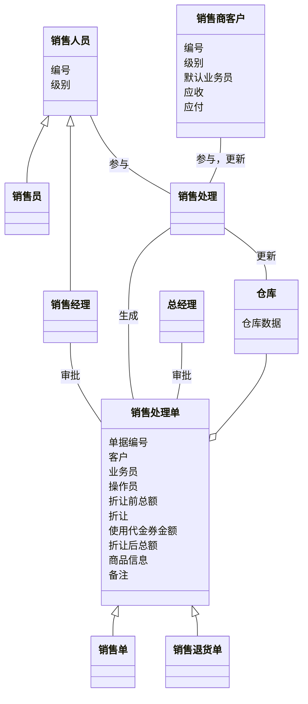
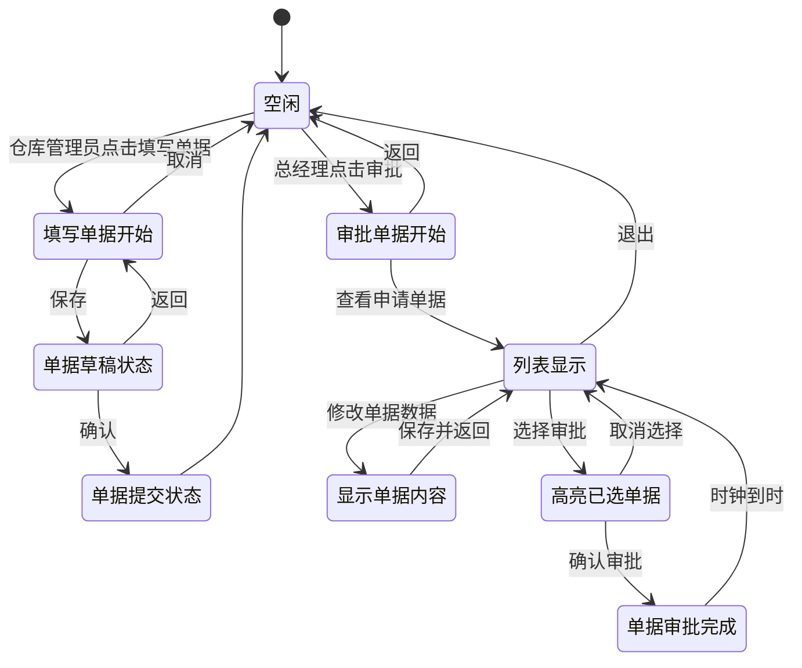

# Lab3

## 小组成员信息及分工

201250175 杨峥 销售模块概念类图

201250176 何浩达 查看经营历程表系统顺序图

201250178 赵勇臻 销售模块概念类图

201250179 张岳轩 单据状态图

注：杨峥和赵勇臻分别完成销售退货和正常销售部分的概念类图，讨论之后进行合并。

## 销售模块概念类图

## 查看经营历程表系统顺序图

## 单据状态图

其它单据和入库单差不多，无非是可能增加两级审批。